<link rel="preconnect" href="https://fonts.googleapis.com">
<link rel="preconnect" href="https://fonts.gstatic.com" crossorigin>
<link href="https://fonts.googleapis.com/css2?family=Inter:wght@400;500;600;700&family=Fraunces:opsz,wght@9..144,500;9..144,700&family=JetBrains+Mono:wght@400;500;600&display=swap" rel="stylesheet">

<style>
:root {
  --max-width: 1800px;
  --font-sans: 'Inter', -apple-system, BlinkMacSystemFont, 'Segoe UI', system-ui, sans-serif;
  --font-display: 'Fraunces', 'Inter', Georgia, serif;
  --font-mono: 'JetBrains Mono', 'SF Mono', Consolas, 'Liberation Mono', Menlo, monospace;
  --color-text: #1f2328;
  --color-text-muted: #57606a;
  --color-bg-soft: #f6f8fa;
  --color-bg-subtle: #fafbfc;
  --color-border: #d0d7de;
  --color-border-strong: #afb8c1;
  --color-link-hover: #0550ae;
  --color-accent: #1f6feb;
  --shadow-sm: 0 1px 2px rgba(0,0,0,0.04);
  --shadow-md: 0 4px 12px rgba(0,0,0,0.06);
  --radius-sm: 6px;
  --radius-md: 8px;
}

html { -webkit-font-smoothing: antialiased; -moz-osx-font-smoothing: grayscale; text-rendering: optimizeLegibility; }

body {
  font-family: var(--font-sans);
  line-height: 1.7;
  color: var(--color-text);
  padding: 2.5rem 2rem 4rem;
  font-feature-settings: "kern" 1, "liga" 1, "calt" 1, "ss01" 1;
}

h1, h2, h3, h4, h5, h6 { color: #0f172a; letter-spacing: -0.011em; line-height: 1.2; margin-top: 2em; }
h1 { font-family: var(--font-display); font-size: 2.4em; letter-spacing: -0.02em; border-bottom: 2px solid var(--color-border); padding-bottom: 0.4em; }
h2 { font-family: var(--font-display); font-size: 1.7em; font-weight: 600; letter-spacing: -0.015em; border-bottom: 1px solid var(--color-border); padding-bottom: 0.35em; margin-top: 2.5em; }
h3 { font-size: 1.28em; color: #1e293b; }
h4 { font-size: 1.08em; color: #334155; }

strong { color: #0f172a; }

a {
  border-bottom: 1px solid transparent;
  transition: border-color 0.15s ease, color 0.15s ease;
}
a:hover { color: var(--color-link-hover); border-bottom-color: var(--color-link); text-decoration: none; }
p a[href*="ADR-"], li a[href*="ADR-"], td a[href*="ADR-"] { font-variant-numeric: tabular-nums; font-weight: 500; }

img { max-height: 700px; border-radius: var(--radius-md); box-shadow: var(--shadow-md); background: white; }
.svg-container svg, .embedded-svg { max-height: 700px; }

pre { border: 1px solid var(--color-border); border-radius: var(--radius-md); line-height: 1.55; font-feature-settings: "calt" 1, "liga" 1; }
pre.mermaid { background: transparent; border: none; padding: 1.5rem 0; }
code { font-feature-settings: "calt" 1; }
:not(pre) > code { background: var(--color-bg-soft); border: 1px solid var(--color-border); padding: 0.18em 0.4em; border-radius: 4px; }

blockquote {
  padding: 0.8em 1.2em;
  border-left: 4px solid var(--color-accent);
  background: linear-gradient(to right, rgba(31,111,235,0.04), rgba(31,111,235,0));
  border-radius: 0 var(--radius-sm) var(--radius-sm) 0;
  color: var(--color-text);
}
blockquote p:first-child { margin-top: 0; }
blockquote p:last-child { margin-bottom: 0; }

table {
  font-size: 0.94em;
  box-shadow: var(--shadow-sm);
  border-radius: var(--radius-md);
  overflow: hidden;
}
th, td { border: none; border-bottom: 1px solid var(--color-border); padding: 0.7em 1em; vertical-align: top; }
th { background: var(--color-bg-soft); color: #0f172a; letter-spacing: -0.005em; border-bottom: 2px solid var(--color-border-strong); }
tr:nth-child(even) td { background: var(--color-bg-subtle); }
tr:hover td { background: rgba(31, 111, 235, 0.04); }

details {
  margin: 1em 0;
  padding: 0.5em 1em;
  border: 1px solid var(--color-border);
  border-radius: var(--radius-md);
  background: var(--color-bg-subtle);
}
details[open] { background: white; }
summary { cursor: pointer; font-weight: 500; color: var(--color-text-muted); padding: 0.25em 0; user-select: none; }
summary:hover { color: var(--color-link); }

hr { border: none; border-top: 1px solid var(--color-border); margin: 3em 0; }
</style>

# Memory Storage Architecture — Upstream Intention vs Upstream Today vs Fork Today

**Status**: Reference document, last rewritten 2026-05-13
**Purpose**: Three-lens comparison of (1) upstream's documented memory architecture intention, (2) upstream as actually shipped today, and (3) fork as actually shipped today. Informs [ADR-0179](../../../adr/export/html/ADR-0179-restore-controller-instrumentation-lost-in-adr0085-bridge-deletion.html), [ADR-0177](../../../adr/export/html/ADR-0177-adopt-upstream-agentdb-rvf-vision.html), and a proposed ADR-0180 codifying the forward direction.
**Council transcripts**: [r1 (bridge deletion)](../council/ADR-0179-council-r1-bridge-deletion.md), [r2 (axis architecture)](../council/ADR-0179-council-r2-axis-architecture.md), [r3 (bridge coordination)](../council/ADR-0179-council-r3-bridge-coordination.md).
**Primary evidence**: 9-agent audit of `ruvnet/agentdb` HEAD `a478ab3` (in ADR-0177); body-diff of `ruvnet/ruflo` `memory-bridge.ts` HEAD `ef73a1616` (in r3 transcript).

---

## TL;DR

The headline framing across earlier drafts of this document — "fork added a second MCP surface" — was wrong. Both upstream and fork have **two MCP surfaces** (`memory_*` + `agentdb_*`). The divergence is one layer lower.

| Layer | Upstream intention | Upstream today | Fork today | Divergence |
|---|---|---|---|---|
| MCP surfaces | 2 (`memory_*` + `agentdb_*`) | 2 (verified — 18 `agentdb_*` tools in `agentdb-tools.ts`) | 2 (~50 `agentdb_*` tools; fork added ~32 controller-specific extensions) | None on count |
| Substrate count | 1 (`.rvf` Cognitive Container) | 1 (`.swarm/memory.db` + fallback cascade) | **2** (`memory.rvf` + `.swarm/memory.db`) | Fork-added |
| Cross-tool coordination | Implicit (single store) | Allowed (via `memory-bridge.ts`) | **Forbidden** ([ADR-0112](../../../adr/export/html/ADR-0112-independent-stores-not-cross-store.html)) | Fork-added rule |
| Self-learning wrapper default | On (per [ADR-006](https://github.com/ruvnet/agentdb/blob/main/docs/adrs/ADR-006-unified-self-learning-rvf-integration.md) `learning: true`) | **Orphaned** (factory returns bare `RvfBackend`) | Fork fix landed in commit `511b7d3` | Fork one fix ahead |

Five load-bearing findings the audit + body-diffs surfaced:

- The **"150-12,500× speedup"** routinely cited for the fork's RVF substrate is RVF NAPI HNSW vs upstream's sql.js cosine-over-JSON fallback. Against upstream's actual primary path (RVF native HNSW), the honest comparator is **2-3×, occasionally 5× on JOIN-heavy reads**. No benchmark of the honest comparator has been run.
- **Upstream's bridge is a half-finished chokepoint.** It guards 5 of 13+ mutation paths. The unguarded 8 include `bridgeHierarchicalStore`, `bridgeBatchOperation`, `bridgeRecordCausalEdge`, session lifecycle. Restoring "as upstream has it" reproduces an incomplete chokepoint that LOOKS complete.
- **Upstream's `SelfLearningRvfBackend` (487 LoC) is orphaned at `factory.ts:166`.** ADR-006 specifies `learning: true` as default but is still in "Proposed" status three months on. Not "they forgot" — it's an unfinished governance handoff. The fork already flipped the factory locally in commit `511b7d3`.
- **ADR-0177's "RVF-only" target is operationally impossible** because the 10+ neural controllers have FK-structured relational schemas RVF cannot host as `JOIN`-able tables. The realistic target is RVF + SQLite hybrid forever, with per-controller System-of-Record assignment.
- **`bridgeRecordFeedback` has 3-4× silent storage amplification** — every feedback event writes to `learningSystem` AND `reasoningBank` AND `skills` AND unconditionally to `bridgeStoreEntry`'s SQL path with no dedup. Invisible in the API.

The fork's three rounds of council deliberation converged 7-of-7 voting members on a single forward architecture (see [§5](#5-forward-direction)) with a residual naming dispute (bridge vs middleware) over the same architectural object.

---

## Explain it like I'm 15

The agent has a notebook. Two things go in it: **facts** (short text with a meaning fingerprint called an embedding) and **structured records** (skills, episodes, causal chains — relational stuff with columns and joins).

Both upstream and fork ship **two tool families** for putting things in the notebook: `memory_*` for the fact-and-embedding stuff, `agentdb_*` for the structured-record stuff. That's not divergence — that's parallel evolution. The earlier drafts of this doc were wrong about this.

**The actual divergence is one layer below.** Upstream uses ONE notebook (one file on disk) and lets a coordination layer (the bridge) route writes from both tool families into it. The fork uses TWO notebooks (two files) — `memory_*` writes to a fast binary `.rvf` file, `agentdb_*` writes to a SQLite `.db` file — and wrote a rule ([ADR-0112](../../../adr/export/html/ADR-0112-independent-stores-not-cross-store.html)) saying *"no tool can write to both notebooks."*

**Why the fork did this.** [ADR-0086](../../../adr/export/html/ADR-0086-layer1-storage-abstraction.html) tried to unify on ONE notebook (RVF) for everything. It hit a wall called "Debt 15": ten neural-controller tables have foreign keys and joins that RVF (which is just key-value + vectors) cannot host. So the fork ended up with RVF for vectors and SQLite for relational structures. Then [ADR-0112](../../../adr/export/html/ADR-0112-independent-stores-not-cross-store.html) made "two notebooks, no coordination" into a rule. Then [ADR-0085](../../../adr/export/html/ADR-0085-bridge-deletion-ideal-state-gaps.html) deleted the bridge because the rule made it homeless.

**The cost of the split:**
- Two files to back up. Two files to lose if your disk has a bad day.
- Six features (write-validation, audit log, cache, fancy search-result-explanations, etc.) used to live in the bridge as cross-cutting concerns. They had nowhere to go after the deletion and got lost ([round 1 audit](../council/ADR-0179-council-r1-bridge-deletion.md)).
- Asking "what did Agent X do today?" needs two log queries merged by timestamp.

**The bug the fork already fixed but upstream hasn't.** Upstream built a smart "self-learning wrapper" (`SelfLearningRvfBackend`) that watches every search, learns from feedback, and gets better — claimed to deliver +36% recall gain. They put it in the codebase. But the factory function that creates the notebook **returns the dumb version, not the smart one**. Their own design doc says it should be on by default but the design doc has been in "Proposed" status for three months. Not "they forgot" — it's that nobody has flipped the switch the design doc says to flip. The fork flipped it locally in commit `511b7d3`.

**What the council figured out.** Three rounds of expert deliberation converged on this: keep both tool families (matching upstream), unify the storage substrate where possible (matching upstream's intent), and add a thin coordination layer (~500-1000 lines, not the 2,370 of upstream's bridge) that applies cross-cutting concerns uniformly via type-enforced wrappers. The coordination layer is stronger than upstream's bridge because TypeScript can refuse to register a handler that bypasses it; upstream's runtime convention can be bypassed (and is — 8 of 13 mutation paths in upstream's bridge are unguarded). The naming dispute (call it "bridge" or "middleware module") is the only residual disagreement; both names describe the same architectural object.

That's the whole story. [§5](#5-forward-direction) has the concrete forward proposal.

---

## Scope and definitions

Three concepts are kept distinct throughout:

- **MCP surface** — the tool family the caller invokes (`memory_*` vs `agentdb_*`). User-facing contract.
- **Substrate** — the actual storage engine holding bytes on disk (RVF binary file, SQLite database file). Implementation.
- **Vector backend** — the ANN index implementation (`@ruvector/rvf-node` native HNSW, `@ruvector/core` native HNSW, HNSWLib JS fallback). May be co-located with the substrate or separate.

Each axis can diverge independently. Earlier drafts of this document conflated the surface axis with the substrate axis; the rewrite separates them.

---

## 1. Upstream's documented intention

Source: `ruvnet/agentdb/README.md` + `docs/adrs/ADR-002` through `ADR-010`, verified 2026-05-12 against live GitHub HEAD `a478ab3` (audit in [ADR-0177](../../../adr/export/html/ADR-0177-adopt-upstream-agentdb-rvf-vision.html)).

### 1.1 The "Cognitive Container" vision

Upstream README:

> *"Vector memory that gets smarter every time your agent uses it."*
>
> *"A single-file cognitive container — vectors, indexes, learning state, and a cryptographic audit trail in one `.rvf`."*

The framing: one substrate, one file, one self-describing artifact. Two MCP surfaces (`memory_*` for K/V + vector + 18 `agentdb_*` controller tools per [ADR-0053](https://github.com/ruvnet/ruflo/blob/main/v3/implementation/adrs/ADR-053-agentdb-v3-controller-activation.md)) route through a coordination layer (the bridge) into the single store.

### 1.2 Upstream [ADR-006](https://github.com/ruvnet/agentdb/blob/main/docs/adrs/ADR-006-unified-self-learning-rvf-integration.md) — the no-pgvector mandate

> *"Storage Backend: @ruvector (NOT pgvector). All vector persistence in the RVF stack uses the @ruvector ecosystem exclusively. The system MUST NOT use `pgvector` for any vector storage, indexing, or search operations."*
>
> *"Any future PostgreSQL integration MUST use @ruvector's native extension that reads/writes `.rvf` segments directly, preserving witness chains, lineage tracking, and segment signing. Falling back to pgvector would break the tamper-evident audit trail."*

Implication for the fork: any postgres-as-vector-store path (including [ADR-0174](../../../adr/export/html/ADR-0174-cypher-verification-and-graph-axis.html)/[ADR-0175](../../../adr/export/html/ADR-0175-mandate-ruvector-postgres.html)'s `ruvector-postgres` direction) violates this mandate. [ADR-0177](../../../adr/export/html/ADR-0177-adopt-upstream-agentdb-rvf-vision.html) supersedes that direction explicitly.

### 1.3 Upstream [ADR-007](https://github.com/ruvnet/agentdb/blob/main/docs/adrs/ADR-007-ruvector-full-capability-integration.md) — 5-phase roadmap to 95% coverage

| Phase | Weeks | Goal |
|---|---|---|
| 1 — Critical Path | 1-3 | Native optimizers (AdamW, InfoNCE), full SIMD, WASM verification, RVF compression profiles, Graph Transactions + Cypher, router persistence, batch ops |
| 2 — Kernel Runtimes | 4-6 | Kernel + eBPF embedding APIs, model import/export, WASM in-memory store, ReasoningBank integration, RLM controller for RAG |
| 3 — Advanced Features | 7-10 | TrainingPipeline, segment-signing, temporal-hyperedges, GraphRoPeAttention |
| 4 — Streaming + Graph Events | 11-13 | Streaming token generation, streaming graph queries, hyperbolic attention |
| 5 — Full Ecosystem | 14-16 | RuvLLM engine, model management, WASM memory management |

Success metric: ~95% @ruvector capability coverage from a ~30% baseline.

### 1.4 The self-learning loop ([ADR-005](https://github.com/ruvnet/agentdb/blob/main/docs/adrs/ADR-005-self-learning-pipeline-integration.md) + [ADR-006](https://github.com/ruvnet/agentdb/blob/main/docs/adrs/ADR-006-unified-self-learning-rvf-integration.md))

[ADR-005](https://github.com/ruvnet/agentdb/blob/main/docs/adrs/ADR-005-self-learning-pipeline-integration.md) created 6 self-learning components as standalone classes: `SonaLearningBackend`, `AdaptiveIndexTuner`, `ContrastiveTrainer`, `SemanticQueryRouter`, `FederatedSessionManager`, `RvfSolver`. [ADR-006](https://github.com/ruvnet/agentdb/blob/main/docs/adrs/ADR-006-unified-self-learning-rvf-integration.md) specifies how the wrapper `SelfLearningRvfBackend` composes them into the search/insert hot path:

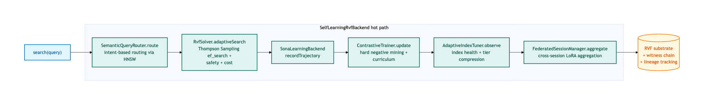

<details>
<summary>Mermaid Source</summary>


```mermaid
%%{init: {"theme": "base"}}%%
flowchart LR
    accTitle: Intended self-learning loop per upstream ADR-006
    accDescr: SelfLearningRvfBackend orchestrates six learning components on every search and insert

    classDef api fill:#E1F5FE,stroke:#0277BD,stroke-width:2px,color:#01579B
    classDef ctrl fill:#E0F2F1,stroke:#00695C,stroke-width:2px,color:#004D40
    classDef storage fill:#FFF8E1,stroke:#F57F17,stroke-width:2px,color:#E65100

    Search["search(query)"]:::api

    subgraph Loop["SelfLearningRvfBackend hot path"]
        Route["SemanticQueryRouter.route<br/>intent-based routing via HNSW"]:::ctrl
        Solve["RvfSolver.adaptiveSearch<br/>Thompson Sampling ef_search +<br/>safety + cost"]:::ctrl
        Trace["SonaLearningBackend<br/>recordTrajectory"]:::ctrl
        Train["ContrastiveTrainer.update<br/>hard negative mining +<br/>curriculum"]:::ctrl
        Tune["AdaptiveIndexTuner.observe<br/>index health + tier compression"]:::ctrl
        Fed["FederatedSessionManager.aggregate<br/>cross-session LoRA aggregation"]:::ctrl
    end

    RVF[("RVF substrate<br/>+ witness chain<br/>+ lineage tracking")]:::storage

    Search --> Route
    Route --> Solve
    Solve --> Trace
    Trace --> Train
    Train --> Tune
    Tune --> Fed
    Fed --> RVF
```

</details>

[ADR-006](https://github.com/ruvnet/agentdb/blob/main/docs/adrs/ADR-006-unified-self-learning-rvf-integration.md) specifies `SelfLearningConfig.learning` default **`true`** — the wrapper is supposed to be on by default, delivering the README's claimed "+36% gain from feedback alone."

### 1.5 Upstream's intended architecture

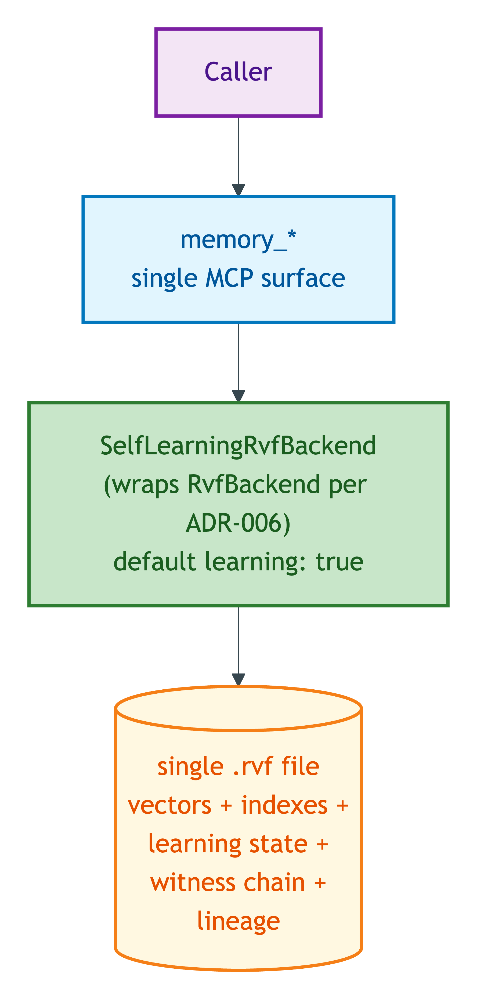

<details>
<summary>Mermaid Source</summary>

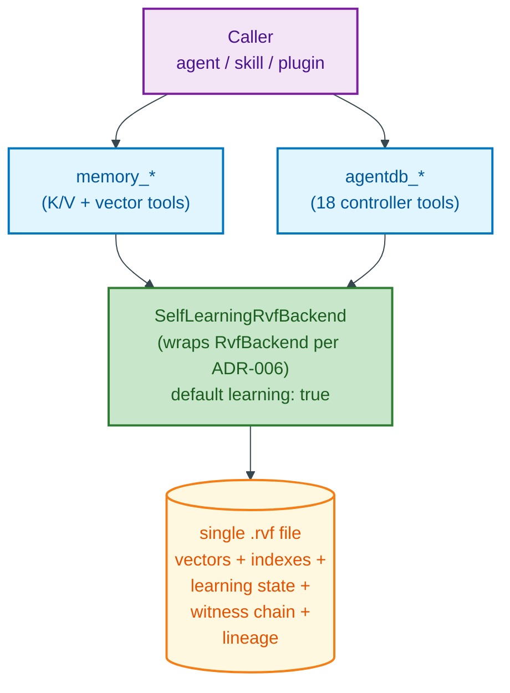
```mermaid
%%{init: {"theme": "base", "themeVariables": {"primaryColor": "#E3F2FD", "primaryTextColor": "#0D47A1", "primaryBorderColor": "#1565C0", "lineColor": "#37474F"}}}%%
flowchart TB
    accTitle: Upstream intended architecture
    accDescr: One file, two MCP surfaces, self-learning wrapper composes six components, all on the RVF substrate

    classDef user fill:#F3E5F5,stroke:#7B1FA2,stroke-width:2px,color:#4A148C
    classDef api fill:#E1F5FE,stroke:#0277BD,stroke-width:2px,color:#01579B
    classDef wrapper fill:#C8E6C9,stroke:#2E7D32,stroke-width:2px,color:#1B5E20
    classDef storage fill:#FFF8E1,stroke:#F57F17,stroke-width:2px,color:#E65100

    User["Caller<br/>agent / skill / plugin"]:::user
    MCP1["memory_*<br/>(K/V + vector tools)"]:::api
    MCP2["agentdb_*<br/>(18 controller tools)"]:::api
    Wrap["SelfLearningRvfBackend<br/>(wraps RvfBackend per ADR-006)<br/>default learning: true"]:::wrapper
    RVF[("single .rvf file<br/>vectors + indexes +<br/>learning state +<br/>witness chain +<br/>lineage")]:::storage

    User --> MCP1
    User --> MCP2
    MCP1 --> Wrap
    MCP2 --> Wrap
    Wrap --> RVF
```

</details>

One substrate, one wrapper, two surfaces, one file. The Cognitive Container.

---

## 2. Upstream as actually shipped today

Source: ADR-0177's 9-agent audit (2026-05-12) against `ruvnet/agentdb` HEAD `a478ab3` + body-diff of `ruvnet/ruflo` `memory-bridge.ts` HEAD `ef73a1616` (round-3 transcript).

### 2.1 Per-ADR implementation status

| Upstream ADR | Title | Declared status | Actual % | Key finding |
|---|---|---|---|---|
| [ADR-002](https://github.com/ruvnet/agentdb/blob/main/docs/adrs/ADR-002-ruvector-wasm-integration.md) | RuVector WASM Integration | Partially Implemented | **~22%** | CLI scaffolding ships but compute paths are JS simulations. 8 "New Files" don't exist. |
| [ADR-003](https://github.com/ruvnet/agentdb/blob/main/docs/adrs/ADR-003-rvf-native-format-integration.md) | RVF Format Integration | Proposed | **~80%** | Core `RvfBackend` (749 LoC), factory wiring, progressive indexing, solver — all ship. Status field stale. |
| [ADR-004](https://github.com/ruvnet/agentdb/blob/main/docs/adrs/ADR-004-agi-capabilities-integration.md) | AGI Capabilities Integration | Accepted | **~90%** | All 4 N-API methods, AgentDBSolver wrapper, all 5 CLI subcommands wired. |
| [ADR-005](https://github.com/ruvnet/agentdb/blob/main/docs/adrs/ADR-005-self-learning-pipeline-integration.md) | Self-Learning Pipeline | Accepted | **100%** | All 6 components exist (~2,841 LoC, real algorithmic content). |
| [ADR-006](https://github.com/ruvnet/agentdb/blob/main/docs/adrs/ADR-006-unified-self-learning-rvf-integration.md) | Unified Self-Learning RVF Integration | **Proposed** | **~70%** | Wrapper exists (487 LoC) but `factory.ts:166` returns bare `RvfBackend`. **Orphaned.** No-pgvector mandate verified in code. |
| [ADR-007](https://github.com/ruvnet/agentdb/blob/main/docs/adrs/ADR-007-ruvector-full-capability-integration.md) | Full Capability Integration | Phase 1 Complete | **~45%** | Phase 1: 95%; Phases 2-5 trail (35%, 15%, 5%, 25%). |
| [ADR-008](https://github.com/ruvnet/agentdb/blob/main/docs/adrs/ADR-008-chat-ui-rvf-kernel-embedding.md) | @agentdb/chat — RVF Chat UI | Proposed (Rev 4) | **0%** | Package doesn't exist. README's `@agentdb/chat serve` claim is misattributed. |
| [ADR-009](https://github.com/ruvnet/agentdb/blob/main/docs/adrs/ADR-009-causal-atlas-rvf-runtime.md) | Causal Atlas RVF Runtime | (no Status field) | **0%** | **6-byte placeholder file containing the literal text "i weds"**. No design content. |
| [ADR-010](https://github.com/ruvnet/agentdb/blob/main/docs/adrs/ADR-010-rvf-solver-v014-deep-integration.md) | rvf-solver Deep Integration | Proposed | **~70%** | Phases 1, 2, 4 substantially complete. Phase 3 entirely absent (4 MCP solver tools missing). |

**Aggregate**: ~60% across 8 non-stub ADRs. Range 0%-100%. Median ~70%.

### 2.2 The orphaned self-learning wrapper

The single most-important divergence between upstream's intention and upstream's reality:

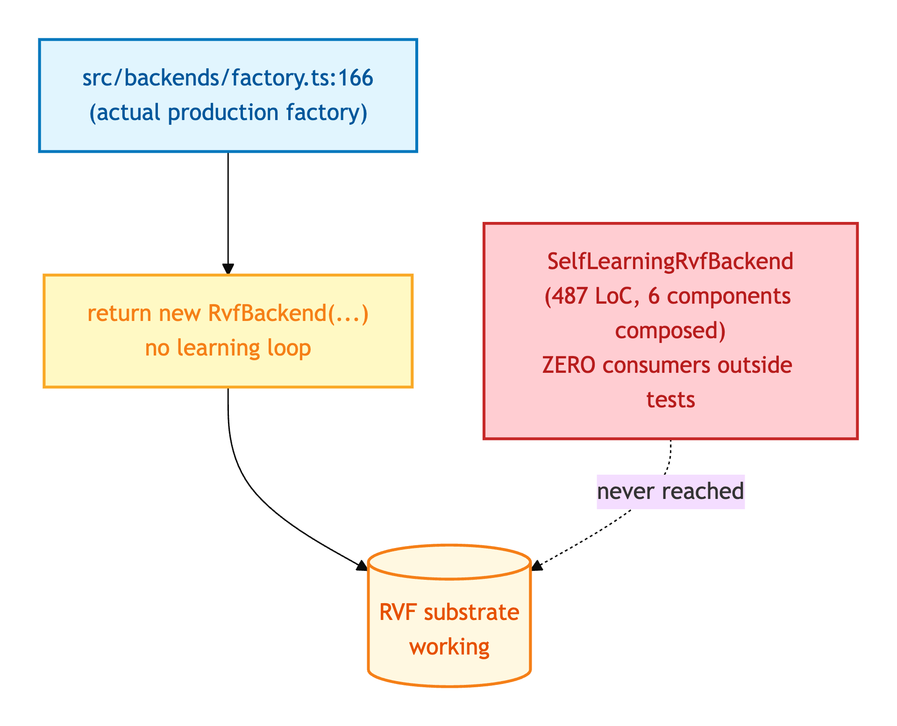

<details>
<summary>Mermaid Source</summary>

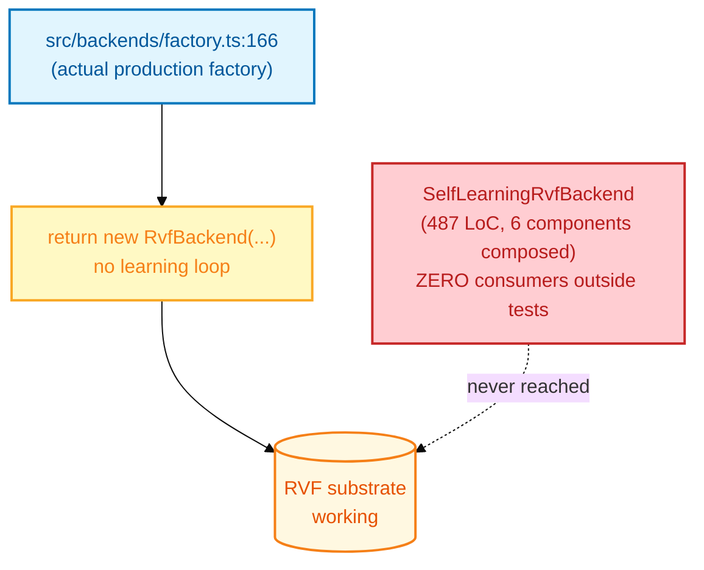
```mermaid
%%{init: {"theme": "base"}}%%
flowchart TB
    accTitle: Upstream's orphaned self-learning wrapper
    accDescr: The wrapper exists but factory returns bare RvfBackend, leaving self-learning loop unreachable in default installs

    classDef api fill:#E1F5FE,stroke:#0277BD,stroke-width:2px,color:#01579B
    classDef orphan fill:#FFCDD2,stroke:#C62828,stroke-width:2px,color:#B71C1C
    classDef storage fill:#FFF8E1,stroke:#F57F17,stroke-width:2px,color:#E65100
    classDef warn fill:#FFF9C4,stroke:#F9A825,stroke-width:2px,color:#F57F17

    Factory["src/backends/factory.ts:166<br/>(actual production factory)"]:::api
    Bare["return new RvfBackend(...)<br/>no learning loop"]:::warn
    Wrapper["SelfLearningRvfBackend<br/>(487 LoC, 6 components composed)<br/>ZERO consumers outside tests"]:::orphan
    RVF[("RVF substrate<br/>working")]:::storage

    Factory --> Bare
    Bare --> RVF
    Wrapper -. "never reached" .-> RVF
```

</details>

The honest rationale (from [ADR-0177](../../../adr/export/html/ADR-0177-adopt-upstream-agentdb-rvf-vision.html)'s evidence audit — not "they forgot"):

| Search | Result |
|---|---|
| `factory.ts` references to `SelfLearningRvfBackend` | **Zero.** No TODO, FIXME, "disabled", "opt-in" comment near the return statement. |
| `grep -rn 'SelfLearningRvfBackend' src/` excluding the file itself | **Zero matches anywhere** — not in factory, tests, `index.ts` public exports, or CLI. Built but never even surfaced as a public API. |
| `git log src/backends/factory.ts` | Single commit `8b3388b "init: agentdb package source + marketing UI"`. Entire codebase landed as one initial dump. No subsequent commit refines the factory's return choice. |
| `SelfLearningRvfBackend.ts` header docstring | Plain class description. **No "not yet default" caveat.** |
| ADR-006 `SelfLearningConfig` definition | **`learning?: boolean (default: true)`** — the ADR explicitly designs the wrapper to be default-on. **The factory contradicts the ADR's own design.** |
| ADR-006 status field | **"Proposed"** since 2026-02-17. Not Accepted. **Three months elapsed without status flip.** |
| ADR-006 "Negative" + "Risks" sections | Enumerate construction costs (~0.7ms latency, async factory + WASM load, learning instability) and **pre-mitigate them** via "conservative defaults — learning is additive, never degrades below baseline." Not framed as reasons to orphan; framed as costs the ADR accepts. |

**The honest read**: ADR-005 (which creates the 6 components) is Accepted at 100%. ADR-006 (which wires them via the wrapper) is Proposed at 70%. **The factory.ts flip is the missing implementation step that gates ADR-006's acceptance. Three months elapsed without it.** This is an unfinished governance handoff, not a designed-and-justified opt-in.

**The fork's response**: ADR-0177 Phase 2 lands the factory flip in `forks/agentdb` commit `511b7d3` (2026-05-12). The fork's `@sparkleideas/agentdb` delivers the README's "+36% feedback gain" claim that `npm i agentdb` from upstream does not. Per memory `feedback-no-upstream-donate-backs`, the fix stays fork-only.

### 2.3 Upstream's runtime cascade

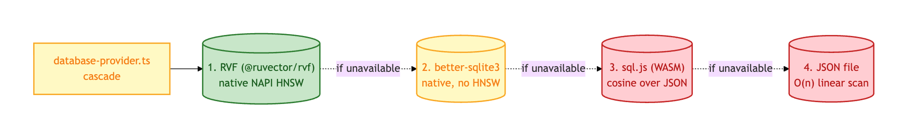

<details>
<summary>Mermaid Source</summary>

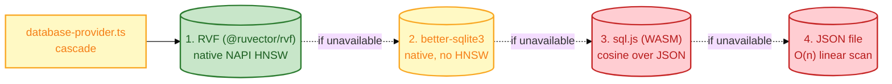
```mermaid
%%{init: {"theme": "base"}}%%
flowchart LR
    accTitle: Upstream's actual substrate cascade
    accDescr: RVF is primary; better-sqlite3 sql.js and JSON are fallbacks for restricted-host environments

    classDef good fill:#C8E6C9,stroke:#2E7D32,stroke-width:2px,color:#1B5E20
    classDef warn fill:#FFF9C4,stroke:#F9A825,stroke-width:2px,color:#F57F17
    classDef bad fill:#FFCDD2,stroke:#C62828,stroke-width:2px,color:#B71C1C

    Try["database-provider.ts<br/>cascade"]:::warn

    RVF[("1. RVF (@ruvector/rvf)<br/>native NAPI HNSW")]:::good
    Bsq[("2. better-sqlite3<br/>native, no HNSW")]:::warn
    Sqljs[("3. sql.js (WASM)<br/>cosine over JSON")]:::bad
    Json[("4. JSON file<br/>O(n) linear scan")]:::bad

    Try --> RVF
    RVF -. "if unavailable" .-> Bsq
    Bsq -. "if unavailable" .-> Sqljs
    Sqljs -. "if unavailable" .-> Json
```

</details>

For typical npm-install users on standard Node.js, the runtime path is **RVF + native HNSW** — same substrate as the fork's `memory_*` axis. The sql.js fallback path is for restricted hosts (browsers, Lambda); it exists because `sql.js` is a HARD dependency upstream.

### 2.4 Both MCP surfaces ship via `memory-bridge.ts`

Upstream `agentdb-tools.ts` exposes **18 `agentdb_*` MCP tools** (verified against `ruvnet/ruflo/v3/@claude-flow/cli/src/mcp-tools/agentdb-tools.ts`):

`agentdb_health`, `agentdb_controllers`, `agentdb_hierarchical-store`, `agentdb_hierarchical-recall`, `agentdb_hierarchical-delete`, `agentdb_session-start`, `agentdb_session-end`, `agentdb_causal-edge`, `agentdb_causal-edge-delete`, `agentdb_causal-node-delete`, `agentdb_pattern-store`, `agentdb_pattern-search`, `agentdb_feedback`, `agentdb_consolidate`, `agentdb_route`, `agentdb_semantic-route`, `agentdb_context-synthesize`, `agentdb_batch`.

All 18 route through `memory-bridge.ts` (line 48-54: `let bridgeModule = await import('../memory/memory-bridge.js')`). The bridge writes the actual data into `.swarm/memory.db`. **Upstream's MCP surface has been two families since [ADR-0053](https://github.com/ruvnet/ruflo/blob/main/v3/implementation/adrs/ADR-053-agentdb-v3-controller-activation.md) (2026-02-25). The fork inherited this — did not invent the `agentdb_*` namespace.**

### 2.5 Bridge body-diff — half-finished chokepoint

Round-3 council body-diffed upstream's `memory-bridge.ts` HEAD `ef73a1616` (2,370 lines, 36 exports). Findings:

**Genuinely guard-and-attest (5 functions):**
- `bridgeStoreEntry` — `guardValidate('store', ...)` + `logAttestation('store', ...)`
- `bridgeDeleteEntry` — guard + cache invalidate + attest
- `bridgeDeleteHierarchical` — guard + 4 distinct `logAttestation` callsites per tier
- `bridgeDeleteCausalEdge` — guard + 3 attestation callsites
- `bridgeDeleteCausalNode` — guard + 2 attestation callsites

**Funnel-through (guarded only via internal `bridgeStoreEntry` call):**
- `bridgeStorePattern` — fast path (`reasoningBank.store`) BYPASSES MutationGuard
- `bridgeRecordFeedback` — three controller mutations BEFORE the guarded bridge call

**Unguarded and unattested entirely (8+ functions):**
- `bridgeHierarchicalStore` — direct `hm.store(...)`. No guard. No attest.
- `bridgeBatchOperation` — direct batch ops. No guard.
- `bridgeConsolidate` — direct `mc.consolidate()`. No guard.
- `bridgeRecordCausalEdge` — direct `causalGraph.addEdge(...)`. **Asymmetric**: DELETE is guarded but CREATE isn't.
- `bridgeSessionStart` / `End` / `bridgeRouteTask` — session lifecycle. No guard.
- `bridgeAddToHNSW` — direct index write. No guard.

**The bridge is not a uniform audit chokepoint.** It is a per-function audit pattern applied inconsistently — the kv store/delete path was the model; 8 other mutation paths were never retrofitted.

When discussions say "the bridge is the chokepoint," the honest read is: **upstream meant for it to be the chokepoint, started the work, and shipped it half-done.** Restoring the bridge "as-is" restores the half-done version.

### 2.6 `bridgeRecordFeedback` — 3-4× silent storage amplification

Per perf-judge round-3: every feedback event writes to:
1. `learningSystem.recordFeedback` OR `.record`
2. `reasoningBank.recordOutcome` OR `.record`
3. `skills.promote` in a LOOP over patterns
4. **ALWAYS calls `bridgeStoreEntry` at line 1512** — full coordination stack runs even when `learningSystem`+`reasoningBank` already handled the feedback

No dedup. **Storage amplification factor: ~3-4× per feedback event.** Invisible to the API but very visible in disk usage and write throughput under heavy `hooks_post-task` workload.

---

## 3. Fork as shipped today

### 3.1 Three architectural moves diverged the fork

The fork accumulated three decisions (each locally justified at decision time) whose composition produced the current state:

- **[ADR-0086](../../../adr/export/html/ADR-0086-layer1-storage-abstraction.html) (2026-04-14)** — replaced sql.js with RVF (`@ruvector/rvf-node`) as the primary substrate for `memory_*`. Titled "Single Storage Abstraction (RVF-First)" with *intent* to unify on one substrate. Failed at "Debt 15 ControllerRegistry dual-backend" because the 10+ neural controllers (`reflexionMemory`, `causalGraph`, `skillLibrary`, etc.) need FK-structured relational schemas RVF cannot host as `JOIN`-able tables. **The substrate split is the residue of a failed unification.**
- **[ADR-0085](../../../adr/export/html/ADR-0085-bridge-deletion-ideal-state-gaps.html) (2026-04-13)** — deleted `memory-bridge.ts` (~3,650 lines on fork-side). The cross-cutting coordination layer became collateral. [Round-1 audit](../council/ADR-0179-council-r1-bridge-deletion.md) found 6 features lost.
- **[ADR-0112](../../../adr/export/html/ADR-0112-independent-stores-not-cross-store.html) (2026-05-01)** — formalized Debt 15 as deliberate architecture: *"two independent stores, feature-aligned."* Made the substrate split into a **binding rule**: no MCP tool may span both stores. **This is the actual divergence-from-upstream constraint.**

### 3.2 Fork MCP surfaces — same as upstream

Both tool families ship:
- **`memory_*`** (~13 tools): `memory_store`, `memory_search`, `memory_retrieve`, `memory_delete`, `memory_list`, `memory_consolidate`, `memory_hierarchical_*`, `memory_causal_*`.
- **`agentdb_*`** (~50 tools — fork added ~32 controller-specific extensions to upstream's 18): `agentdb_hierarchical-store/-recall/-delete/-query`, `agentdb_causal-edge/-edge-delete/-node-delete`, `agentdb_session_start/_end`, `agentdb_route`, `agentdb_batch/_optimize`, `agentdb_context_synthesize`, `agentdb_health`, `agentdb_controllers`, plus controller-specific tools for `reasoningBank`, `reflexion`, `skills`, `causalGraph`, `learningSystem`, and more.

This matches upstream (which has 18) plus fork-added extensions. **No surface-level divergence in shape — only in tool count.**

### 3.3 Fork high-level architecture — dual axis

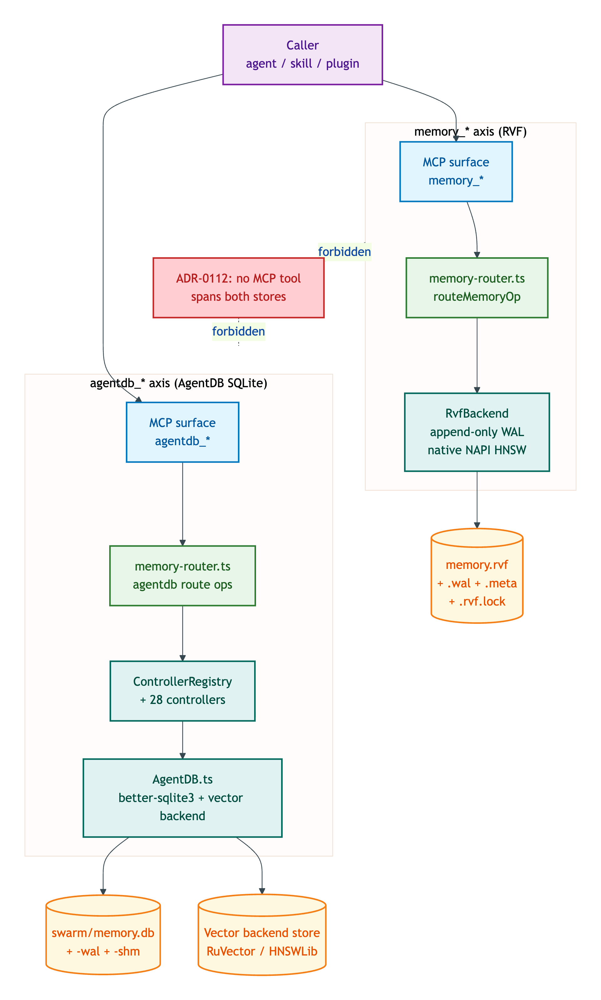

<details>
<summary>Mermaid Source</summary>

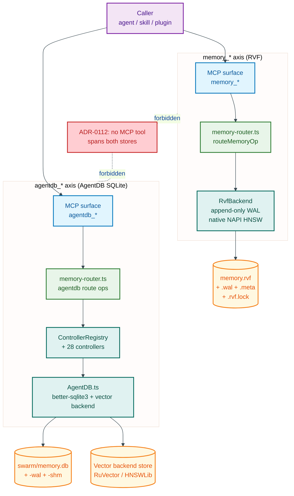
```mermaid
%%{init: {"theme": "base", "themeVariables": {"primaryColor": "#E3F2FD", "primaryTextColor": "#0D47A1", "primaryBorderColor": "#1565C0", "lineColor": "#37474F"}}}%%
flowchart TB
    accTitle: Fork memory architecture with dual axis
    accDescr: Two MCP surfaces route to two physically separate substrate files, no cross-store coordination per ADR-0112

    classDef user fill:#F3E5F5,stroke:#7B1FA2,stroke-width:2px,color:#4A148C
    classDef api fill:#E1F5FE,stroke:#0277BD,stroke-width:2px,color:#01579B
    classDef service fill:#E8F5E9,stroke:#2E7D32,stroke-width:2px,color:#1B5E20
    classDef storage fill:#FFF8E1,stroke:#F57F17,stroke-width:2px,color:#E65100
    classDef ctrl fill:#E0F2F1,stroke:#00695C,stroke-width:2px,color:#004D40
    classDef forbidden fill:#FFCDD2,stroke:#C62828,stroke-width:2px,color:#B71C1C

    User["Caller<br/>agent / skill / plugin"]:::user

    subgraph MemAxis["memory_* axis (RVF)"]
        MemMCP["MCP surface<br/>memory_*"]:::api
        Router1["memory-router.ts<br/>routeMemoryOp"]:::service
        RVFBe["RvfBackend<br/>append-only WAL<br/>native NAPI HNSW"]:::ctrl
    end

    subgraph DBAxis["agentdb_* axis (AgentDB SQLite)"]
        DBMCP["MCP surface<br/>agentdb_*"]:::api
        Router2["memory-router.ts<br/>agentdb route ops"]:::service
        Reg["ControllerRegistry<br/>+ 28 controllers"]:::ctrl
        AgentDB["AgentDB.ts<br/>better-sqlite3 + vector backend"]:::ctrl
    end

    File1[("memory.rvf<br/>+ .wal + .meta<br/>+ .rvf.lock")]:::storage
    File2[("swarm/memory.db<br/>+ -wal + -shm")]:::storage
    VecStore[("Vector backend store<br/>RuVector / HNSWLib")]:::storage

    Block["ADR-0112: no MCP tool<br/>spans both stores"]:::forbidden

    User --> MemMCP
    User --> DBMCP
    MemMCP --> Router1
    Router1 --> RVFBe
    RVFBe --> File1

    DBMCP --> Router2
    Router2 --> Reg
    Reg --> AgentDB
    AgentDB --> File2
    AgentDB --> VecStore

    MemAxis -.forbidden.- Block
    Block -.forbidden.- DBAxis
```

</details>

### 3.4 Data flows per axis

#### memory_store (RVF axis)

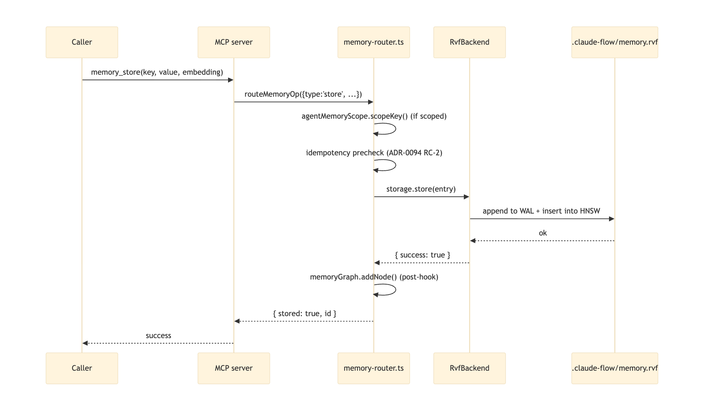

<details>
<summary>Mermaid Source</summary>

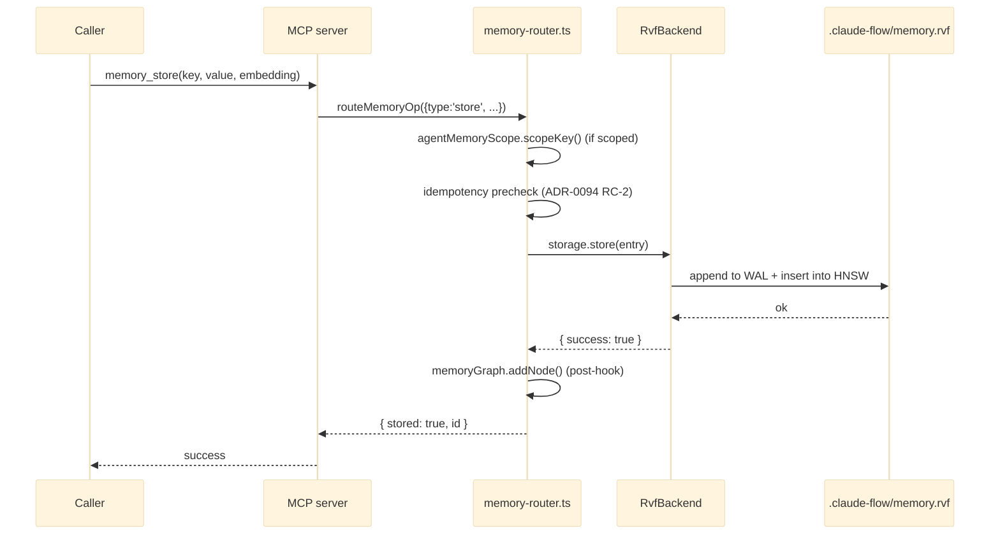
```mermaid
%%{init: {"theme": "base"}}%%
sequenceDiagram
    accTitle: Fork memory_store data flow on RVF axis
    accDescr: memory_* call writes to RVF binary file with native HNSW, never touches SQLite

    participant Caller
    participant MCP as MCP server
    participant Router as memory-router.ts
    participant RVF as RvfBackend
    participant File as .claude-flow/memory.rvf

    Caller->>MCP: memory_store(key, value, embedding)
    MCP->>Router: routeMemoryOp({type:'store', ...})
    Router->>Router: agentMemoryScope.scopeKey() (if scoped)
    Router->>Router: idempotency precheck (ADR-0094 RC-2)
    Router->>RVF: storage.store(entry)
    RVF->>File: append to WAL + insert into HNSW
    File-->>RVF: ok
    RVF-->>Router: { success: true }
    Router->>Router: memoryGraph.addNode() (post-hook)
    Router-->>MCP: { stored: true, id }
    MCP-->>Caller: success
```

</details>

#### agentdb_hierarchical-store (SQLite axis)

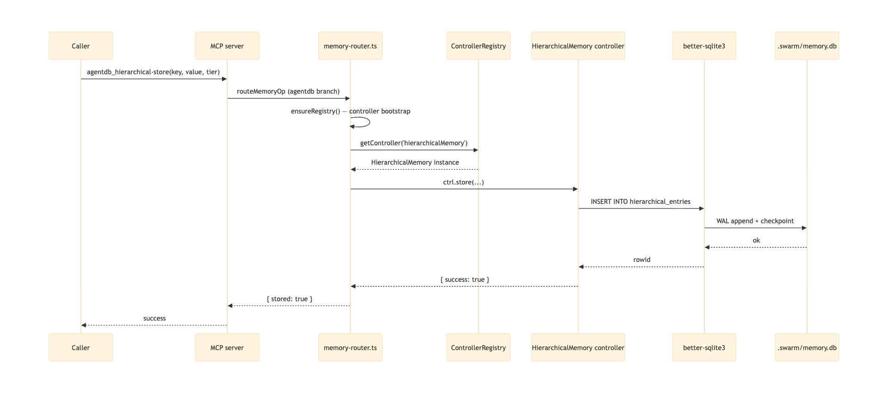

<details>
<summary>Mermaid Source</summary>

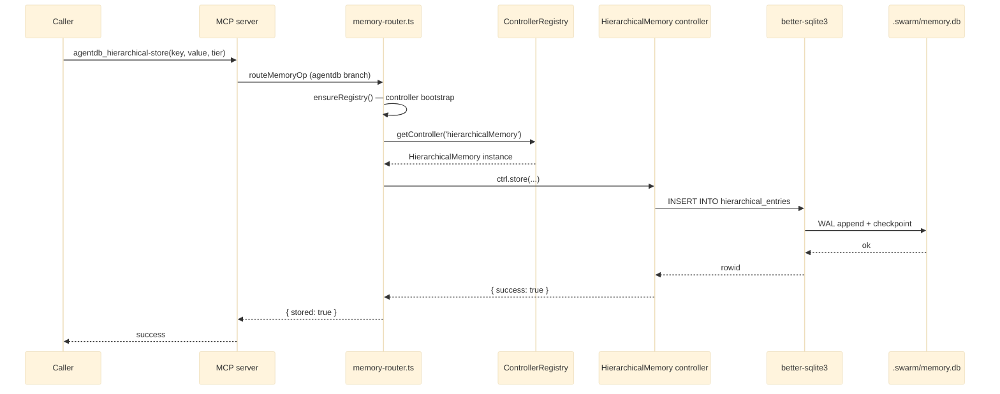
```mermaid
%%{init: {"theme": "base"}}%%
sequenceDiagram
    accTitle: Fork agentdb_hierarchical-store data flow on SQLite axis
    accDescr: agentdb_* call writes to SQLite file via controller, never touches RVF

    participant Caller
    participant MCP as MCP server
    participant Router as memory-router.ts
    participant Reg as ControllerRegistry
    participant Ctrl as HierarchicalMemory controller
    participant DB as better-sqlite3
    participant File as .swarm/memory.db

    Caller->>MCP: agentdb_hierarchical-store(key, value, tier)
    MCP->>Router: routeMemoryOp (agentdb branch)
    Router->>Router: ensureRegistry() — controller bootstrap
    Router->>Reg: getController('hierarchicalMemory')
    Reg-->>Router: HierarchicalMemory instance
    Router->>Ctrl: ctrl.store(...)
    Ctrl->>DB: INSERT INTO hierarchical_entries
    DB->>File: WAL append + checkpoint
    File-->>DB: ok
    DB-->>Ctrl: rowid
    Ctrl-->>Router: { success: true }
    Router-->>MCP: { stored: true }
    MCP-->>Caller: success
```

</details>

### 3.5 On-disk storage layout

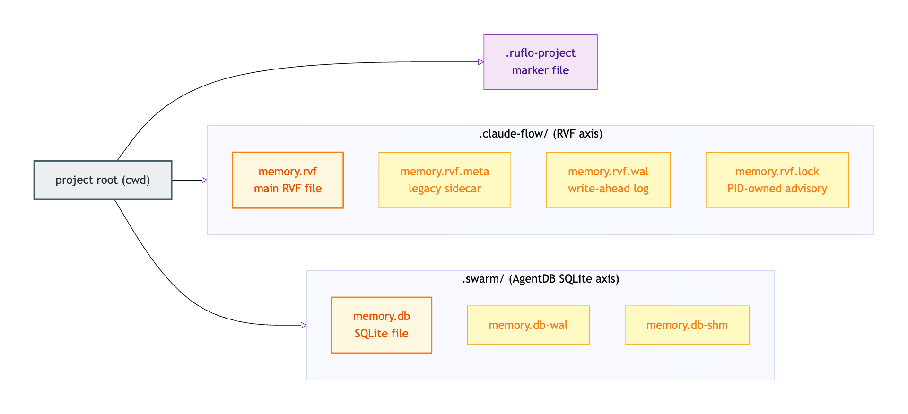

<details>
<summary>Mermaid Source</summary>

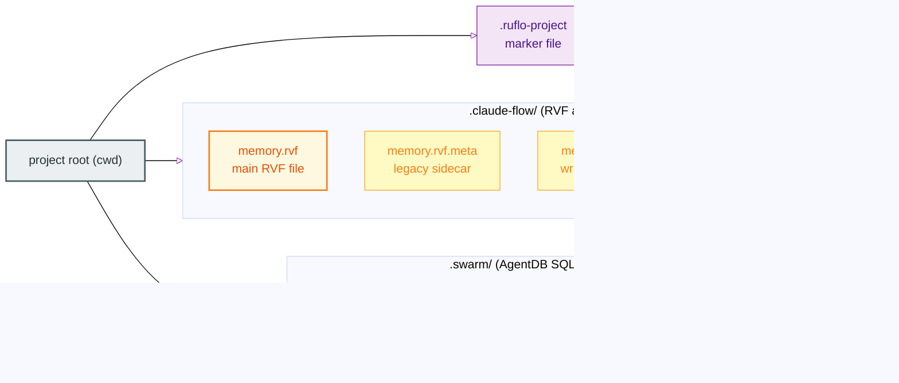
```mermaid
%%{init: {"theme": "base"}}%%
flowchart LR
    accTitle: Fork on-disk storage layout
    accDescr: Two sibling directories at project root hold the two substrate files plus their sibling WAL/lock files

    classDef dir fill:#ECEFF1,stroke:#455A64,stroke-width:2px,color:#263238
    classDef storage fill:#FFF8E1,stroke:#F57F17,stroke-width:2px,color:#E65100
    classDef meta fill:#FFF9C4,stroke:#F9A825,stroke-width:1px,color:#F57F17
    classDef marker fill:#F3E5F5,stroke:#7B1FA2,stroke-width:1px,color:#4A148C

    Root["project root (cwd)"]:::dir
    Marker[".ruflo-project<br/>marker file"]:::marker

    subgraph CF[".claude-flow/ (RVF axis)"]
        RVF["memory.rvf<br/>main RVF file"]:::storage
        Meta["memory.rvf.meta<br/>legacy sidecar"]:::meta
        WAL["memory.rvf.wal<br/>write-ahead log"]:::meta
        Lock["memory.rvf.lock<br/>PID-owned advisory"]:::meta
    end

    subgraph SW[".swarm/ (AgentDB SQLite axis)"]
        DB["memory.db<br/>SQLite file"]:::storage
        DBWAL["memory.db-wal"]:::meta
        DBShm["memory.db-shm"]:::meta
    end

    Root --> Marker
    Root --> CF
    Root --> SW
```

</details>

### 3.6 AgentDB v3 is itself internally hybrid

A point the devil's advocate kept hammering across all 3 council rounds: regardless of the surface architecture, **AgentDB v3 internally already has both SQLite and a native vector index**. Each controller registers a substrate-of-record at construction time.

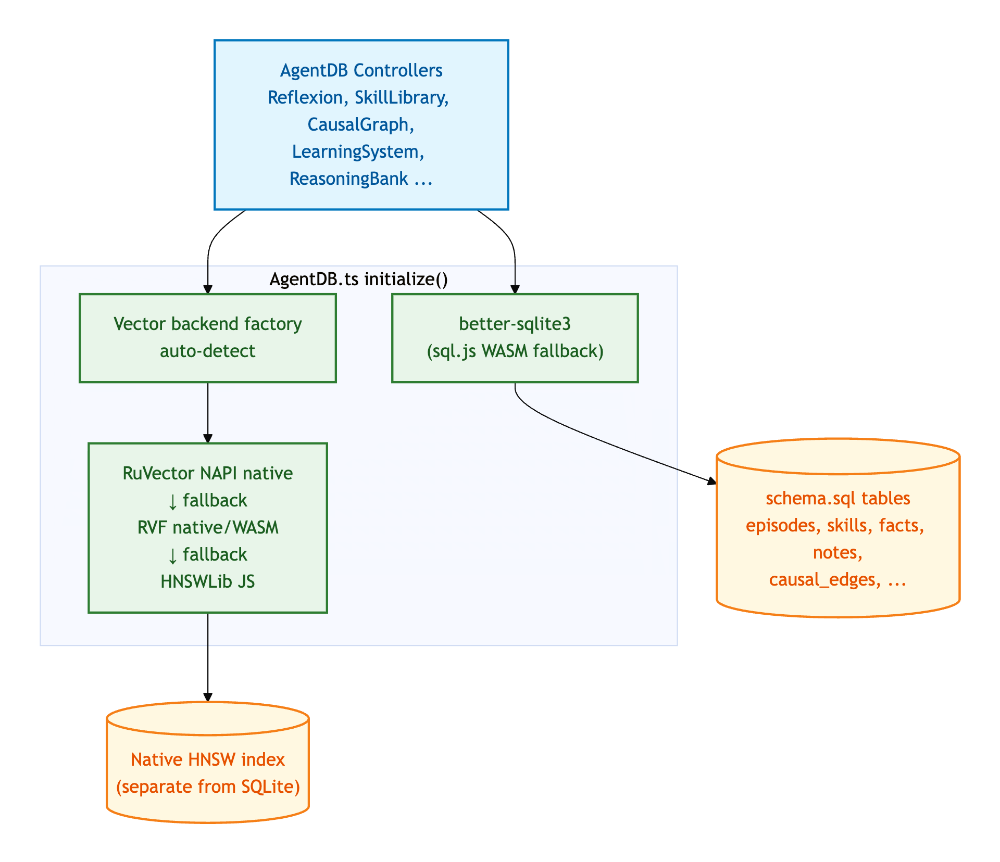

<details>
<summary>Mermaid Source</summary>

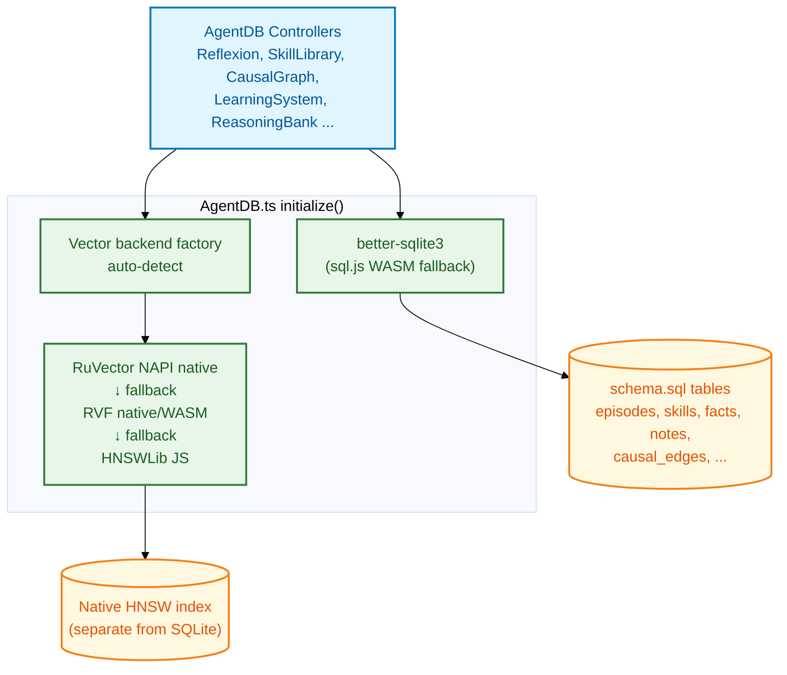
```mermaid
%%{init: {"theme": "base"}}%%
flowchart TB
    accTitle: AgentDB v3 is itself internally hybrid
    accDescr: AgentDB has its own SQLite backend plus a native vector backend selected at runtime

    classDef api fill:#E1F5FE,stroke:#0277BD,stroke-width:2px,color:#01579B
    classDef service fill:#E8F5E9,stroke:#2E7D32,stroke-width:2px,color:#1B5E20
    classDef storage fill:#FFF8E1,stroke:#F57F17,stroke-width:2px,color:#E65100

    Ctrl["AgentDB Controllers<br/>Reflexion, SkillLibrary, CausalGraph,<br/>LearningSystem, ReasoningBank ..."]:::api

    subgraph AgentDB["AgentDB.ts initialize()"]
        SQL["better-sqlite3<br/>(sql.js WASM fallback)"]:::service
        VecFactory["Vector backend factory<br/>auto-detect"]:::service
        VecOpts["RuVector NAPI native<br/>↓ fallback<br/>RVF native/WASM<br/>↓ fallback<br/>HNSWLib JS"]:::service
    end

    DB[("schema.sql tables<br/>episodes, skills, facts, notes,<br/>causal_edges, ...")]:::storage
    Vec[("Native HNSW index<br/>(separate from SQLite)")]:::storage

    Ctrl --> SQL
    Ctrl --> VecFactory
    VecFactory --> VecOpts
    SQL --> DB
    VecOpts --> Vec
```

</details>

Implication: the fork's RVF substrate at `memory_*` adds a *third* storage primitive on top of AgentDB's two. Whether that third primitive earns its keep is the real perf question — and depends on whether RVF (purpose-built single-file vector substrate) outperforms AgentDB's own vector layer by enough to justify the operational cost. Round-2 perf-judge measured **2-3× typical, 5× worst-case JOIN-heavy** — meaningful for high-throughput agent hot loops; below human perception for casual use.

### 3.7 The 6 lost features — ADR-0085 deletion collateral

[Round-1 audit](../council/ADR-0179-council-r1-bridge-deletion.md) walked the 34 functions of upstream's `memory-bridge.ts` against the fork's post-deletion state. **6 features were silently dropped** when [ADR-0085](../../../adr/export/html/ADR-0085-bridge-deletion-ideal-state-gaps.html) removed the bridge module:

| Feature | Where it lived in upstream's bridge | Direct ADR-0053 regression? |
|---|---|---|
| **MutationGuard pre-write gate** | `bridgeStoreEntry` line 549 (`guardValidate(...)`) | Yes — Phase 5 (#1216 territory) |
| **TieredCache write-through** | `bridgeStoreEntry` line 602 (`cacheSet(...)`) | Yes — #1220 |
| **AttestationLog audit** | `bridgeStoreEntry` line 605 (`logAttestation(...)`) | Yes — Phase 5 |
| **Hybrid BM25 + semantic fusion (default)** | `bridgeSearchEntries` lines 687-746 (0.7×semantic + 0.3×BM25, every search) | Yes — Phase 2 |
| **ExplainableRecall provenance strings** | `bridgeSearchEntries` lines 724-726 (`semantic:0.872+bm25:0.310` per result) | Yes — Phase 4 (#1216) |
| **SkillLibrary auto-promotion on feedback** | `bridgeRecordFeedback` lines 1501-1509 (`skills.promote(pattern, quality)` when `quality >= 0.9`) | Yes — Phase 4 |

**These were literal Phase 2/4/5 deliverables of [ADR-0053](https://github.com/ruvnet/ruflo/blob/main/v3/implementation/adrs/ADR-053-agentdb-v3-controller-activation.md), not edge-case instrumentation.** [ADR-0085](../../../adr/export/html/ADR-0085-bridge-deletion-ideal-state-gaps.html)'s structural audit (which counted callers, not behaviors) did not detect the loss. [ADR-0179](../../../adr/export/html/ADR-0179-restore-controller-instrumentation-lost-in-adr0085-bridge-deletion.html) is the proposed restoration.

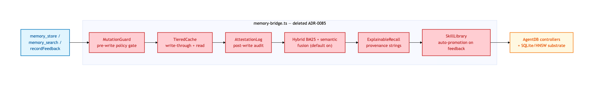

<details>
<summary>Mermaid Source</summary>


```mermaid
%%{init: {"theme": "base"}}%%
flowchart LR
    accTitle: What the bridge did in upstream — chokepoint for cross-cutting concerns
    accDescr: Bridge wired six middleware-style features into the write and read paths; all six were lost when ADR-0085 deleted it

    classDef api fill:#E1F5FE,stroke:#0277BD,stroke-width:2px,color:#01579B
    classDef mid fill:#E0F2F1,stroke:#00695C,stroke-width:2px,color:#004D40
    classDef storage fill:#FFF8E1,stroke:#F57F17,stroke-width:2px,color:#E65100
    classDef lost fill:#FFCDD2,stroke:#C62828,stroke-width:2px,color:#B71C1C

    Tool["memory_store /<br/>memory_search /<br/>recordFeedback"]:::api

    subgraph Bridge["memory-bridge.ts — deleted ADR-0085"]
        G["MutationGuard<br/>pre-write policy gate"]:::lost
        T["TieredCache<br/>write-through + read"]:::lost
        A["AttestationLog<br/>post-write audit"]:::lost
        F["Hybrid BM25 + semantic<br/>fusion (default on)"]:::lost
        E["ExplainableRecall<br/>provenance strings"]:::lost
        S["SkillLibrary<br/>auto-promotion on feedback"]:::lost
    end

    Store["AgentDB controllers<br/>+ SQLite/HNSW substrate"]:::storage

    Tool --> G
    G --> T
    T --> A
    A --> F
    F --> E
    E --> S
    S --> Store
```

</details>

---

## 4. Three-way comparison

### 4.1 At-a-glance

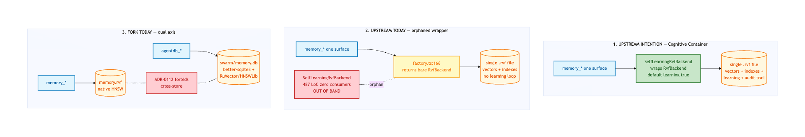

<details>
<summary>Mermaid Source</summary>


```mermaid
%%{init: {"theme": "base"}}%%
flowchart TB
    accTitle: Three-way architecture comparison
    accDescr: Upstream intention versus upstream today versus fork today side by side

    classDef api fill:#E1F5FE,stroke:#0277BD,stroke-width:2px,color:#01579B
    classDef storage fill:#FFF8E1,stroke:#F57F17,stroke-width:2px,color:#E65100
    classDef good fill:#C8E6C9,stroke:#2E7D32,stroke-width:2px,color:#1B5E20
    classDef warn fill:#FFF9C4,stroke:#F9A825,stroke-width:2px,color:#F57F17
    classDef bad fill:#FFCDD2,stroke:#C62828,stroke-width:2px,color:#B71C1C

    subgraph Intent["1. UPSTREAM INTENTION — Cognitive Container"]
        IMCP1["memory_*"]:::api
        IMCP2["agentdb_*"]:::api
        IWrap["SelfLearningRvfBackend<br/>wraps RvfBackend<br/>default learning true"]:::good
        IRVF[("single .rvf file<br/>vectors + indexes +<br/>learning + audit trail")]:::storage
        IMCP1 --> IWrap
        IMCP2 --> IWrap
        IWrap --> IRVF
    end

    subgraph Today["2. UPSTREAM TODAY — orphaned wrapper"]
        TMCP1["memory_*"]:::api
        TMCP2["agentdb_* (18 tools)"]:::api
        TBridge["memory-bridge.ts<br/>guards 5 of 13 paths"]:::warn
        TBare["factory.ts:166<br/>returns bare RvfBackend"]:::warn
        TOrphan["SelfLearningRvfBackend<br/>487 LoC zero consumers<br/>OUT OF BAND"]:::bad
        TDB[("swarm/memory.db<br/>+ fallback cascade")]:::storage
        TMCP1 --> TBridge
        TMCP2 --> TBridge
        TBridge --> TBare
        TBare --> TDB
        TOrphan -. orphan .- TBare
    end

    subgraph Fork["3. FORK TODAY — dual substrate"]
        FMCPm["memory_*"]:::api
        FMCPa["agentdb_*"]:::api
        FRVF[("memory.rvf<br/>native HNSW")]:::storage
        FDB[("swarm/memory.db<br/>better-sqlite3 +<br/>RuVector/HNSWLib")]:::storage
        Block["ADR-0112 forbids<br/>cross-store"]:::bad
        FMCPm --> FRVF
        FMCPa --> FDB
        FRVF -.- Block
        Block -.- FDB
    end
```

</details>

### 4.2 Feature-by-feature comparison

Numbers marked **(est.)** are reasoned estimates, not measured benchmarks. Per-ADR percentages from the [9-agent audit](../../../adr/export/html/ADR-0177-adopt-upstream-agentdb-rvf-vision.html) (2026-05-12).

| Dimension | (1) Upstream intention | (2) Upstream today | (3) Fork today |
|---|---|---|---|
| **MCP surfaces** | 2 (`memory_*` + `agentdb_*`) | 2 (18 `agentdb_*` verified in `agentdb-tools.ts`) | 2 (~50 `agentdb_*` — 18 upstream + ~32 fork extensions) |
| **Files on disk** | 1 (`.rvf` Cognitive Container) | 1 (`.swarm/memory.db` + cascade fallback) | 2 (`.rvf` + `.db`) plus sibling WAL/lock files |
| **Substrate** | RVF only (no pgvector per ADR-006) | RVF primary + sqlite/json cascade for restricted hosts | RVF (memory_*) + AgentDB SQLite (agentdb_*) |
| **Vector index** | Native NAPI HNSW; learning-aware | Native NAPI HNSW via bare `RvfBackend` | Native NAPI HNSW (RVF) + RuVector/HNSWLib (agentdb) |
| **Self-learning loop** | Default-on per ADR-006 (`learning: true`) — README claims +36% gain | **Orphaned** — wrapper exists, factory returns bare RvfBackend | Not wired in upstream code; **fork ADR-0177 Phase 2 flips factory in commit `511b7d3`** |
| **Cross-tool coordination** | Implicit (one store) | Allowed via `memory-bridge.ts` | **Forbidden by ADR-0112** |
| **Audit chokepoint coverage** | All mutations (per ADR-006 design) | 5 of 13 mutation paths guarded — **half-finished** | None (bridge deleted) — ADR-0179 proposes restoration |
| **Cypher / graph** | Cypher via `querySync` per ADR-007 Phase 1 #6 | Hollow — `graph-node` NAPI does label-only Match; Delete + Return are no-op | Hollow upstream; fork has narrow ~1KLoC patch ready as ADR-0177 Phase 3 |
| **Per-ADR implementation %** | n/a (intention) | 022/080/090/100/070/045/000/000/070 → **aggregate ~60%** | Inherits upstream baseline + fork-only divergence |
| **`pgvector` / postgres-as-vector** | Forbidden by ADR-006 mandate | Verified: zero matches in `src/` | Currently zero (fork's earlier pg-direction ADR-0170/0174/0175 superseded by ADR-0177) |
| **Cold-start cost (est.)** | ~5-15ms (one RVF file open + mmap) | ~5-15ms RVF / ~3-10ms sqlite fallback | ~8-25ms (two file opens) |
| **Hot-path search latency (est.)** | ~0.3-1ms (NAPI HNSW + learning overhead) | ~0.3-1ms (NAPI HNSW, no learning loop) | ~0.3-1ms RVF axis / ~1-5ms agentdb with JOIN |
| **+36% feedback gain delivered** | Yes (design intent) | **No** — orphaned wrapper blocks delivery | No upstream; **fork commit `511b7d3` would enable it** pending verification |
| **6 cross-cutting features (Guard/Attest/Cache/BM25/Provenance/SkillPromote)** | Designed | Half-shipped at the bridge (5 of 13 guarded; 8 unguarded; bridgeRecordFeedback 3-4× amplification) | Lost (ADR-0085 deletion); restoration tracked by ADR-0179 |
| **Backup procedure** | Copy one `.rvf` file | Copy one `.db` file | Coordinate two files atomically |
| **Cognitive tax (caller)** | None — single mental model | None — single mental model | Must pick axis at design time |
| **Workload-correct storage** | One substrate fits everything | One substrate fits everything when wrapper enabled | RVF for vectors, SQLite for relational — at the cost of two of everything |

### 4.3 Search-path comparison — where the perf difference actually shows

Write paths look similar across architectures. Read paths — specifically vector search — are where the 2-3× / 5-50× perf gaps live.

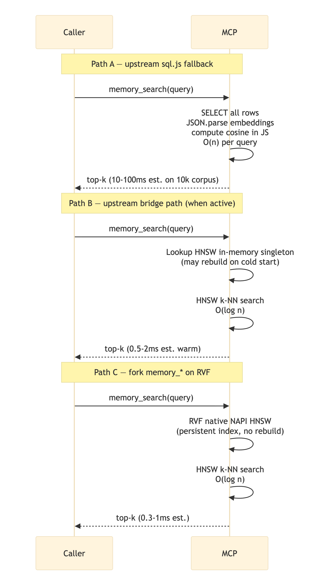

<details>
<summary>Mermaid Source</summary>

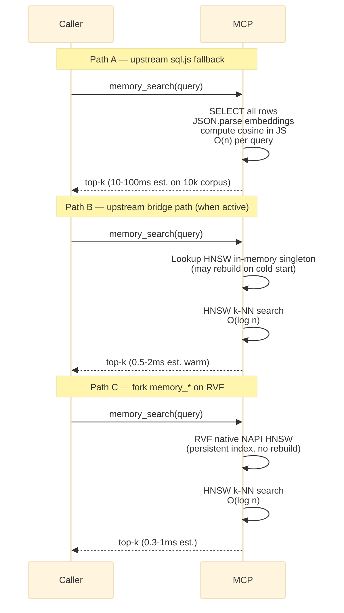
```mermaid
%%{init: {"theme": "base"}}%%
sequenceDiagram
    accTitle: Vector search path comparison
    accDescr: Three search paths shown to highlight where perf differences come from

    participant Caller
    participant MCP

    Note over Caller,MCP: Path A — upstream sql.js fallback
    Caller->>MCP: memory_search(query)
    MCP->>MCP: SELECT all rows<br/>JSON.parse embeddings<br/>compute cosine in JS<br/>O(n) per query
    MCP-->>Caller: top-k (10-100ms est. on 10k corpus)

    Note over Caller,MCP: Path B — upstream bridge path (when active)
    Caller->>MCP: memory_search(query)
    MCP->>MCP: Lookup HNSW in-memory singleton<br/>(may rebuild on cold start)
    MCP->>MCP: HNSW k-NN search<br/>O(log n)
    MCP-->>Caller: top-k (0.5-2ms est. warm)

    Note over Caller,MCP: Path C — fork memory_* on RVF
    Caller->>MCP: memory_search(query)
    MCP->>MCP: RVF native NAPI HNSW<br/>(persistent index, no rebuild)
    MCP->>MCP: HNSW k-NN search<br/>O(log n)
    MCP-->>Caller: top-k (0.3-1ms est.)
```

</details>

**The "150-12,500× speedup" is Path A vs Path C** — comparing the worst upstream fallback to the best fork path. The **honest comparator** (Path B vs Path C, both native HNSW) is **2-3×** per round-2 perf-judge analysis. **Neither comparator has been benchmarked with current fork code; both are reasoned estimates.**

---

## 5. Forward direction

Three rounds of expert council deliberation (transcripts: [r1](../council/ADR-0179-council-r1-bridge-deletion.md), [r2](../council/ADR-0179-council-r2-axis-architecture.md), [r3](../council/ADR-0179-council-r3-bridge-coordination.md)) on three questions:

- **R1**: Should ADR-0085's bridge deletion be undone? (Verdict: 6 B / 1 C / 1 A — restore features as call sites; don't restore the module as-was.)
- **R2**: Should the fork keep dual-axis substrate (X), collapse to upstream-style single-axis (Y), or adopt single-MCP-surface dual-substrate-internal (Z)? (Verdict: 6 of 8 endorse Z.)
- **R3**: Where do the 6 lost features land? Bridge-shape chokepoint or per-handler middleware? (Verdict: 3 bridge / 3 middleware / 1 hybrid / 1 opposition — but 7-of-7 voting members agree on the architecture.)

The R3 mid-session reframe ("ADRs as exploration inputs, not commitments to honor") removed the constraint-defense framing and surfaced substantive convergence the raw vote masked.

### 5.1 The 10-point convergence

All 7 voting council members (excluding the opposition-by-role devils-advocate) agreed on:

1. **One thin coordinator** (~500-1000 LoC, NOT 2,370) at the MCP-tool-dispatch boundary.
2. **Cross-cutting middleware applied uniformly** there: MutationGuard / AttestationLog / TieredCache / BM25 fusion / ExplainableRecall provenance / SkillLibrary auto-promotion (with dedup to fix the 3-4× amplification).
3. **Type-level enforcement** via branded types + required `MutationContext` argument. The compiler refuses to register a mutation handler that bypasses the guard. **This is stronger than upstream's bridge**, which is a runtime convention with known incomplete coverage (5 of 13 paths).
4. **Substrate**: RVF-primary with documented PERMANENT_SQLITE carve-outs. **Hybrid forever, not transitional.** Per-controller System-of-Record assignment.
5. **Both MCP surfaces preserved** (`memory_*` + `agentdb_*`). Parallel evolution with upstream.
6. **Controllers own their internal multi-table transactions.** The coordinator dispatches; controllers own FK consistency (matching upstream's pattern).
7. **[ADR-0112](../../../adr/export/html/ADR-0112-independent-stores-not-cross-store.html) retired** — drop the no-cross-surface-coordination rule.
8. **Lazy-per-tool init** (perf-judge): registry construction deferred, not eager. Preserves ADR-0170 Phase C.3's cold-start win.
9. **Single audit chain above the substrate split**; substrate is a record-property (`substrate: 'rvf' | 'sqlite'`), not an identity.
10. **+36% wrapper fix lands at the coordinator** as a single insertion point. Already shipped in `forks/agentdb` commit `511b7d3`.

### 5.2 Synthesized forward architecture

A thin coordinator at the MCP-tool-dispatch boundary applying cross-cutting middleware:

```
src/memory/coordinator/  (~500-1000 LoC total)
  index.ts                              // barrel
  register-mutation-handler.ts          // typed factory enforcing GuardedWrite<T>
  guard.ts                              // MutationGuard via branded GuardedWrite<T>
  attest.ts                             // AttestationLog → separate attestation.db (upstream pattern)
  cache.ts                              // TieredCache read-side + invalidation
  bm25.ts                               // hybridScore(query, rows, embed): BM25 + cosine fusion
  provenance.ts                         // explainRecall: semantic:N+bm25:N strings
  skill-promote.ts                      // skills.promote dedup-aware
  context.ts                            // MutationContext type + chain-link
```

Handler shape (illustrative):

```typescript
import { registerMutationHandler } from '../memory/coordinator/index';

export const memoryStore = registerMutationHandler<MemoryStoreArgs, MemoryStoreResult>({
  name: 'memory_store',
  handler: async (args, ctx) => {
    // ctx is MutationContext: carries guard verdict, attestation chain head, cache key
    const controller = getController('memory');      // ADR-0084 Phase 4 path preserved
    const result = await controller.store(args, ctx); // controller requires ctx; throws fatal if absent
    return result;
  },
});
```

**Properties this gives us**:

- **Bypass impossible by construction**: TypeScript refuses to register a `memory_*` or `agentdb_*` mutation handler without going through `registerMutationHandler`. Closes upstream's 5-of-13 gap to **13 of 13 mutation paths guarded**.
- **One audit chain** above the substrate split. `attestation.db` separate file preserved per upstream's pattern (append-only audit survives application-data corruption).
- **Controllers own their txns**. The coordinator does dispatch + middleware; controllers handle their FK-structured data internally. Matches upstream's pattern (and matches what already works).
- **No god-module**: ~500-1000 LoC vs upstream's 2,370. Drops: registry indirection (ADR-0084 resolves at handler), direct SQL writes (controllers own writes), HNSW-singleton dynamic-import dances, the 54-of-64 unused upstream exports.
- **Audit-table itself isn't load-bearing for app data**: separate `attestation.db` file means rebuilding the audit chain doesn't risk application state.

### 5.3 The residual disagreement: naming, not architecture

3 R3 experts (bridge-defender, memory-judge, integration-judge) advocate calling this `controller-bridge.ts` for line-level structural homology with upstream's `memory-bridge.ts` (merge-alignment benefits). 3 R3 experts (status-quo-defender, security-judge, perf-judge) advocate `src/memory/middleware/` to make type-enforcement visible in the file structure.

**These are not architecturally different objects.** Per memory-judge's load-bearing observation:

> *"The bridge isn't axis-shaped — it's a dispatcher with middleware. Round-2's axis framing collapses under the bridge frame."*

And per perf-judge:

> *"The router-shim form of middleware IS the bridge with worse vocabulary."*

A "thin bridge module that applies typed middleware via HOF" and "a middleware module that registers handlers via a typed factory" are the same shape. **A neutral third name** is `controller-coordinator.ts` or `mcp-dispatch.ts` — captures both camps' instincts. **The naming dispute doesn't affect what gets built.**

### 5.4 Implications for downstream ADRs

- **[ADR-0179](../../../adr/export/html/ADR-0179-restore-controller-instrumentation-lost-in-adr0085-bridge-deletion.html) refinement**: the 6 lost features land at the single thin coordinator via type-enforced HOF + middleware (closing upstream's half-finished gap at all 13+ mutation paths). The "shared write-middleware module" from R1's verdict becomes "thin-coordinator-with-typed-HOF + controller-MutationContext-backstop."
- **[ADR-0177](../../../adr/export/html/ADR-0177-adopt-upstream-agentdb-rvf-vision.html) honesty pass**: ADR-0177's "RVF-only" target needs explicit amendment to "RVF-primary with documented PERMANENT_SQLITE carve-outs, per-controller SoR." Memory-judge bombshell #2.
- **[ADR-0112](../../../adr/export/html/ADR-0112-independent-stores-not-cross-store.html) retired**: drop the no-cross-surface-coordination rule. The coordinator handles cross-surface uniformly. Naming the prior ADR as "exploration that taught us coordination-prohibition is costly" rather than "wrong" per the user's reframe.
- **[ADR-0086](../../../adr/export/html/ADR-0086-layer1-storage-abstraction.html) status section**: amend to acknowledge Debt 15 as a permanent operational reality (RVF + SQLite hybrid forever), not a partial-success awaiting closure.
- **ADR-0180 (proposed)**: codify the forward direction — the 10-point convergence above as the new memory-architecture spec. Supersedes ADR-0112; refines ADR-0179 and ADR-0177.

---

## 6. Timeline — how exploration produced the forward direction

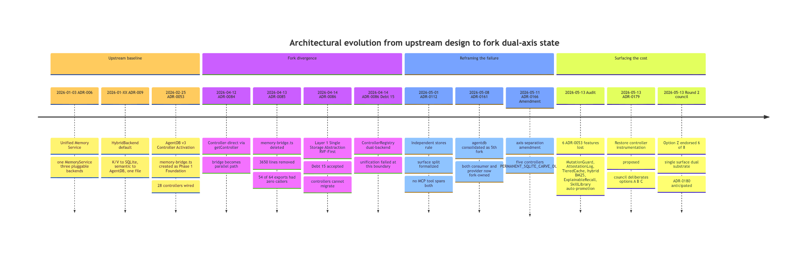

<details>
<summary>Mermaid Source</summary>

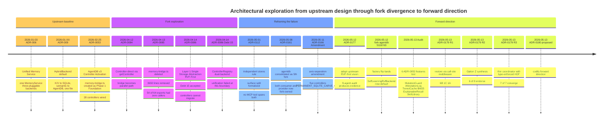
```mermaid
%%{init: {"theme": "base"}}%%
timeline
    title Architectural exploration from upstream design through fork divergence to forward direction
    section Upstream baseline
        2026-01-03 ADR-006 : Unified Memory Service : one MemoryService three pluggable backends
        2026-01-XX ADR-009 : HybridBackend default : K/V to SQLite, semantic to AgentDB, one file
        2026-02-25 ADR-0053 : AgentDB v3 Controller Activation : memory-bridge.ts created as Phase 1 Foundation : 28 controllers wired
    section Fork exploration
        2026-04-12 ADR-0084 : Controller-direct via getController : bridge becomes parallel path
        2026-04-13 ADR-0085 : memory-bridge.ts deleted : 3650 lines removed : 54 of 64 exports had zero callers
        2026-04-14 ADR-0086 : Layer 1 Single Storage Abstraction RVF-First : Debt 15 accepted : controllers cannot migrate
        2026-04-14 ADR-0086 Debt 15 : ControllerRegistry dual-backend : unification failed at this boundary
    section Reframing the failure
        2026-05-01 ADR-0112 : Independent stores rule : surface split formalized : no MCP tool spans both
        2026-05-08 ADR-0161 : agentdb consolidated as 5th fork : both consumer and provider now fork-owned
        2026-05-11 ADR-0166 Amendment : axis-separation amendment : five controllers PERMANENT_SQLITE_CARVE_OUT
    section Forward direction
        2026-05-12 ADR-0177 : adopt upstream RVF-first vision : 9-agent audit produces evidence
        2026-05-12 fork-agentdb 511b7d3 : factory flip lands : SelfLearningRvfBackend now default
        2026-05-13 Audit : 6 ADR-0053 features lost : MutationGuard AttestationLog TieredCache BM25 ExplainableRecall SkillLibrary
        2026-05-13 ADR-0179 R1 : restore via call-site middleware : 6B 1C 1A
        2026-05-13 ADR-0179 R2 : Option Z synthesis : 6 of 8 endorse
        2026-05-13 ADR-0179 R3 : thin coordinator with type-enforced HOF : 7 of 7 converge
        2026-05-13 ADR-0180 proposed : codify forward direction
```

</details>

**The arc**: ADR-0053 staked a position (bridge as foundation). ADR-0084/0085/0086/0112 explored what happens when you compress that position toward router-direct, substrate-split, coordination-forbidden, and bridge-deleted. ADR-0166/0177 explored re-convergence. The 2026-05-13 audit + 3-round council deliberation is the empirical readout.

**Lessons extracted (not constraints honored):**

1. **Substrate divergence has hidden costs** (ADR-0170/0174/0175 explored postgres; broke witness chains; ADR-006's no-pgvector mandate was load-bearing in ways the fork didn't appreciate). → RVF-primary is correct.
2. **Removing coordination chokepoints loses cross-controller invariants silently** (ADR-0085 deletion lost 6 features the structural audit missed). → Restore a coordination shape.
3. **Surface bifurcation isn't divergence** (both upstream and fork have memory_* + agentdb_*; parallel evolution). → Keep both surfaces.
4. **God-modules with 64 exports drift into dead surface** (ADR-0085 audit found 54 of 64 zero-caller exports). → Keep the coordinator thin (~500-1000 LoC) and type-enforced.
5. **Type-enforcement beats runtime convention** (upstream's bridge guards 5 of 13 paths because the convention isn't enforced). → Branded types + `MutationContext` argument.

---

## 7. Open questions

- **Honest RVF-vs-AgentDB-HNSW benchmark not run.** Round-2 DA flagged: no measurement of RVF (NAPI HNSW) vs AgentDB's own native HNSW on representative fork workload. The 2-3× estimate is reasoned from code paths, not measured. Should run before any irrevocable substrate decision.
- **Naming choice for the coordinator.** `controller-bridge.ts` / `controller-coordinator.ts` / `src/memory/middleware/` — engineering decision is done; naming dispute is real but doesn't affect what gets built.
- **Migration window length and concrete consistency model.** Round-3 memory-judge proposed SoR-authoritative + MV-best-effort + orphan-sweeper as the steady state, but didn't pin the sweeper cadence or the per-controller SoR table. ADR-0180 needs this filled in.
- **The 17 unreachable controllers from R1 audit**: are they unreachable because the bridge was deleted (will re-reach when coordinator restored) or because their MCP tools never registered? If the latter, coordinator restoration alone doesn't fix them.
- **`agentdb_*` MCP tool migration**: per-controller SoR assignment table needs an explicit list (currently implicit). Some controllers will move to RVF (e.g. `memory_consolidate`-shaped); some stay on SQLite (e.g. `agentdb_causal-edge` with FK consistency).

---

## 8. References

### Upstream agentdb ADRs (verified 2026-05-12 against `ruvnet/agentdb` HEAD `a478ab3`)

- **[ruvnet/agentdb README](https://github.com/ruvnet/agentdb/blob/main/README.md)** — "Single-file cognitive container."
- **[ADR-002](https://github.com/ruvnet/agentdb/blob/main/docs/adrs/ADR-002-ruvector-wasm-integration.md)** — RuVector WASM Integration (~22%; 8 "New Files" don't exist).
- **[ADR-003](https://github.com/ruvnet/agentdb/blob/main/docs/adrs/ADR-003-rvf-native-format-integration.md)** — RVF as v3 format (~80%; status field stale).
- **[ADR-004](https://github.com/ruvnet/agentdb/blob/main/docs/adrs/ADR-004-agi-capabilities-integration.md)** — AGI Capabilities Integration (~90%).
- **[ADR-005](https://github.com/ruvnet/agentdb/blob/main/docs/adrs/ADR-005-self-learning-pipeline-integration.md)** — Self-Learning Pipeline (**100%** — 6 components, ~2,841 LoC).
- **[ADR-006](https://github.com/ruvnet/agentdb/blob/main/docs/adrs/ADR-006-unified-self-learning-rvf-integration.md)** — Unified Self-Learning RVF Integration (~70%; **wrapper orphaned**; no-pgvector mandate).
- **[ADR-007](https://github.com/ruvnet/agentdb/blob/main/docs/adrs/ADR-007-ruvector-full-capability-integration.md)** — Full Capability Integration (~45%; 5-phase 16-week roadmap to 95%).
- **[ADR-008](https://github.com/ruvnet/agentdb/blob/main/docs/adrs/ADR-008-chat-ui-rvf-kernel-embedding.md)** — @agentdb/chat (0%; README claim misattributed).
- **[ADR-009](https://github.com/ruvnet/agentdb/blob/main/docs/adrs/ADR-009-causal-atlas-rvf-runtime.md)** — Causal Atlas RVF Runtime (0% — **6-byte placeholder file "i weds"**).
- **[ADR-010](https://github.com/ruvnet/agentdb/blob/main/docs/adrs/ADR-010-rvf-solver-v014-deep-integration.md)** — rvf-solver Deep Integration (~70%).
- **[ruvnet/RuVector ADR-029](https://github.com/ruvnet/RuVector/blob/main/docs/adr/ADR-029-rvf-canonical-format.md)** — RVF canonical format.

### Upstream ruflo ADR

- **[ADR-0053](https://github.com/ruvnet/ruflo/blob/main/v3/implementation/adrs/ADR-053-agentdb-v3-controller-activation.md)** — AgentDB v3 Controller Activation (Implemented in v3.1.0-alpha.51). Created `memory-bridge.ts` as Phase 1 Foundation.

### Fork ADRs

HTML versions at `docs/adr/export/html/`.

- **[ADR-0039](../../../adr/export/html/ADR-0039a-upstream-controller-integration-roadmap.html)** — Upstream AgentDB Controller Integration Roadmap (2026-03-15, superseded).
- **[ADR-0067](../../../adr/export/html/ADR-0067-original-vision-controller-wiring.html)** — The Original Vision: How Controller Wiring Was Supposed to Work (2026-04-05, informational).
- **[ADR-0084](../../../adr/export/html/ADR-0084-dead-code-cleanup.html)** Phase 4 (2026-04-12) — Controller-direct access via `getController()`.
- **[ADR-0085](../../../adr/export/html/ADR-0085-bridge-deletion-ideal-state-gaps.html)** (2026-04-13) — Bridge deletion.
- **[ADR-0086](../../../adr/export/html/ADR-0086-layer1-storage-abstraction.html)** (2026-04-14) — Layer 1 storage abstraction (RVF-First). Debt 15 dual-backend.
- **[ADR-0112](../../../adr/export/html/ADR-0112-independent-stores-not-cross-store.html)** (2026-05-01) — Independent stores rule. **Proposed for retirement under ADR-0180.**
- **ADR-0170** Phase C.3 — Init-cost split. Substrate work superseded by ADR-0177.
- **ADR-0174** + **ADR-0175** — Graph axis + ruvector-postgres direction (superseded by ADR-0177).
- **[ADR-0177](../../../adr/export/html/ADR-0177-adopt-upstream-agentdb-rvf-vision.html)** (2026-05-12, proposed) — Adopt upstream agentdb's RVF-first vision. Contains the 9-agent audit.
- **ADR-0178** — Restore hierarchical-memory implementation.
- **[ADR-0179](../../../adr/export/html/ADR-0179-restore-controller-instrumentation-lost-in-adr0085-bridge-deletion.html)** (2026-05-13, proposed) — Restore controller instrumentation lost in ADR-0085.
- **ADR-0180** (proposed, drafted alongside this doc rewrite) — Codifies the forward direction: thin coordinator, type-enforced HOF, hybrid substrate, ADR-0112 retired.

### Council transcripts

- **[ADR-0179-council-r1-bridge-deletion](../council/ADR-0179-council-r1-bridge-deletion.md)** — Should ADR-0085 be undone?
- **[ADR-0179-council-r2-axis-architecture](../council/ADR-0179-council-r2-axis-architecture.md)** — Should the axis split itself be undone?
- **[ADR-0179-council-r3-bridge-coordination](../council/ADR-0179-council-r3-bridge-coordination.md)** — Where do the 6 lost features land?

### Key fork memories

- `project-rvf-primary.md` — RVF is primary for `memory_*`; SQLite is primary for `agentdb_*` (axis-separation per ADR-0166 Amendment).
- `project-fork-only-controllers.md` — 8 fork-only controllers restored from `bd760f2`, 4 deferred.
- `reference-embedding-model.md` — `Xenova/all-mpnet-base-v2`, 768-dim, HNSW m=23/efC=100/efS=50.
- `feedback-no-upstream-donate-backs.md` — Fork improvements stay fork-only; no PRs to ruvnet/* repos.
