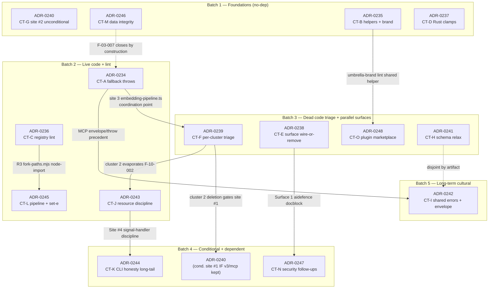

# Second-pass execution plan (2026-05-24)

Companion to [[ADR-0233]] (Second-pass soundness audit findings),
[[2026-05-24-second-pass-remediation-plan]] (swarm-review plan), and
[[ADR-0201]] (audit methodology + pre-flight checklist).

This document describes the EXECUTION of the 15 second-pass remediation ADRs
([[ADR-0234]] through [[ADR-0248]]) by implementation swarms — NOT the review
of the ADRs themselves. For each ADR:

1. The concrete implementation contract a coder worker reads (files, steps,
   "optimise as you go" instruction).
2. The post-implementation validation gates that prove the as-built code is
   sound + complete (build green, tests green, acceptance check passes,
   behaviour probe X returns Y).
3. The execution batches that allow multiple implementation swarms to run
   concurrently, with inter-batch gates honouring hard sequencing.

Per [[hive-mind:hive-mind-advanced]], the default swarm shape is **Pattern 3
Implementation Hive** (architect-vote on plan → parallel build → review-vote on
merge readiness). Each batch ships through one P3 hive per ADR; parallelism
happens across ADRs within a batch.

---

## Executive summary

| Metric | Value |
|--------|-------|
| Total remediation ADRs | 15 ([[ADR-0234]]…[[ADR-0248]]) + 2 singletons (F-08-003, F-08-004) |
| Execution batches | **5** |
| Max parallel ADRs per batch | **4** (Batch 3) |
| Critical-path length (hard-seq chain) | **5 ADRs**: [[ADR-0246]] → [[ADR-0234]] → [[ADR-0239]] → [[ADR-0240]] → [[ADR-0244]] |
| Biggest cross-bonus | **[[ADR-0239]] cluster 2** (delete `v3/mcp/`) — closes F-10-002 (CT-J / [[ADR-0243]] site #2) + F-05-001 (CT-G / [[ADR-0240]] site #1) + F-11-016 (singleton) in **one delete** |
| Total inter-batch validation gates | **4** (between batches 1→2, 2→3, 3→4, 4→5) |
| Singleton fast-track | 2 (F-08-003 one-line, F-08-004 collision fix) — outside batch flow, can ship as solo commits |

---

## Dependency graph



### Hard sequencing + cross-bonus + file-overlap table

| ADR | CT | Hard deps (must land first) | Cross-bonus / coordination | File-overlap conflicts |
|-----|------|------------------------------|----------------------------|------------------------|
| 0240 (site #2) | CT-G | none | — | none |
| 0240 (site #1) | CT-G | **0239 cluster 2** decision | If `v3/mcp/` deleted → site #1 retracted (auto-close) | `forks/ruflo/v3/mcp/server-entry.ts` (cond.) |
| 0246 | CT-M | none | F-03-007 closes when 0234 lands (no action required) | `forks/agentdb/src/backends/rvf/*.ts`, `factory.ts`, `archivist/index.ts` |
| 0235 | CT-B | none (but gates 0211 reach) | Shares `_brand-forbidden.mjs` helper with 0248 | `forks/ruflo/v3/@claude-flow/cli/src/init/executor.ts`, `.claude-plugin/plugin.json`, `scripts/codemod.mjs` Pass 7 |
| 0237 | CT-D | none | Partial closure of F-06-008 (NaN at boundary) | `forks/ruvector/crates/ruvllm-wasm/src/sona_instant.rs`, `Cargo.toml`, `ruvllm-wasm.ts` |
| 0234 | CT-A | none (extends 0095 amendment) | Closes 0246 F-03-007 + closes 0238 Surface 1 ride-along's premise | `commands/{plugins,claims}.ts`, `ruvector/{vector-db,diskann-backend}.ts`, `embedding-pipeline.ts`, `memory-router.ts` |
| 0236 | CT-C | none | R3 of 0245 extends to `lib/fork-paths.mjs` | `scripts/{fork-version,codemod,build-packages,preflight-discover}.mjs`, `ruflo-publish.sh` Phase 0 |
| 0243 | CT-J | none for live sites; F-10-002 defers to 0239 | Site #4 signal-handler → 0244 F-01-002 unblocked | `mcp-tools/{ruvllm,hooks}-tools.ts`, `services/worker-daemon.ts`, `rvf-backend.ts`, new `.eslintrc.json` files |
| 0245 | CT-L | none | R3 extends 0236 single-source pattern; lint composes with gate-0 | `scripts/{ruflo-publish,publish-verdaccio,audit-dynamic-imports}.sh`, `lib/pipeline-helpers.sh` (new), `lib/fork-paths.mjs` (new) |
| 0239 | CT-F | **0234 site 3** (CVE-loader relocation premise); coordination on `embedding-pipeline.ts` | **DOMINANT CROSS-BONUS**: cluster 2 closes F-10-002+F-05-001+F-11-016; cluster 4 absorbs F-08-001 singleton; cluster 5(a) closes F-11-* | Many — see per-cluster table in 0239 |
| 0238 | CT-E | none for surfaces 2/3/5/6/7/8; Surface 4 references 0239 quarantine pattern | Surface 1 docblock gates 0247 site #2 | `aidefence/src/index.ts`, `hive-mind-tools.ts`, `agentdb-tools.ts:1587-1641`, swarm consensus headers |
| 0248 | CT-O | none | Shares `_brand-forbidden.mjs` helper with 0235 | `forks/ruflo/.claude-plugin/marketplace.json`, `plugins/ruflo-{agentdb,core,…}/`, new `plugin-marketplace-integrity.test.mjs` |
| 0241 | CT-H | none in this batch (ADR-0204(b) out of scope) | Disjoint from 0247 + 0242 by seam | `memory-tools.ts:193`, `cli-core/.../validate-input.ts:248`, new arch-test |
| 0247 | CT-N | **0238 Surface 1** for site #2 | Site #2 rides on 0238 Surface 1 commit | `mcp-client.ts`, `security-tools.ts`, `aidefence/src/index.ts` (joint with 0238) |
| 0244 | CT-K | **0243 Site #4** for F-01-002 (signal-handler discipline) | Pass 7 extension touches `scripts/codemod.mjs` (coordinate with 0235's Pass 7 extension) | Many `commands/*.ts`, `parser.ts:486`, `scripts/codemod.mjs` Pass 7 |
| 0242 | CT-I | none (long-term cultural; can land last) | Disjoint from 0247 by artifact | New `@claude-flow/errors/` package, `gastown-bridge/errors.ts` shim, 2 new lint scripts |

---

## Critical path

The longest hard-sequencing chain — i.e., the ADR ordering where each step blocks the
next — defines minimum batch count:

```
[[ADR-0246]]  (Batch 1, independent CRITICAL data-integrity)
  ↓  (no dep, sequential narrative only — both can be in B1)
[[ADR-0234]]  (Batch 2, fallback throws — surfaces CVE-loader gap)
  ↓  (site 3 embedding-pipeline.ts coordination on CVE-loader relocation premise)
[[ADR-0239]]  (Batch 3, dead-code triage — cluster 4 relocates the CVE loader; cluster 2 cross-bonus)
  ↓  (cluster 2 decides v3/mcp/ → gates 0240 site #1)
[[ADR-0240]] site #1  (Batch 4, conditional — retract or apply)
  ↓  (CT-J Site #4 signal-handler must land before F-01-002 — independent batch placement)
[[ADR-0244]]  (Batch 4, depends on 0243 Site #4 from Batch 2)
```

**5-ADR critical-path chain** anchors the 5-batch structure. All other ADRs ride
parallel to this chain.

---

## Cross-bonus optimisation map

| Trigger ADR | Action | Collapses findings | Saving (vs separate) |
|-------------|--------|---------------------|------------------------|
| [[ADR-0239]] cluster 2 | `git rm -r forks/ruflo/v3/mcp/` (5,587 LOC) | F-10-002 (CT-J / 0243 site #2) + F-05-001 (CT-G / 0240 site #1) + F-11-016 (singleton `@claude-flow/mcp` facilities never wired on stdio) | One delete, **3 findings closed**; eliminates 2 conditional code paths; eliminates v3/mcp/.eslintrc.json creation for 0240 site #1 + 0243 lint-scope exemption |
| [[ADR-0239]] cluster 4 step (a) | Relocate `transformers-loader.ts` to `@claude-flow/memory` | Absorbs F-08-001 singleton (defer-with-rationale) + restores CVE-094 posture on live path | 1 file move closes 1 singleton; **gates 0234 site 3 fail-loud throw** to surface the live provider correctly |
| [[ADR-0234]] (any site) | Per-site fail-loud throw | Closes 0246 F-03-007 (`EmbeddingService.mockEmbedding` fallback) **by construction** | No separate work in 0246 |
| [[ADR-0235]] umbrella-brand lint + [[ADR-0248]] marketplace-integrity lint | Factor `tests/pipeline/_brand-forbidden.mjs` shared helper | Both lints reuse single forbidden-string set | Forbidden-set cannot drift between umbrella + per-plugin checks |
| [[ADR-0236]] gate-0 lint + [[ADR-0245]] `lib/fork-paths.mjs` | Compose at `scripts/ruflo-publish.sh` gate-0 + Phase 0 | Both lints gate same entrypoint; 0245 R3 extends 0236 single-source pattern to path defaults | One pipeline-start gate covers both registry-drift classes |
| [[ADR-0238]] Surface 1 docblock + [[ADR-0247]] F-04-010 | Joint rewrite at `aidefence/src/index.ts:1-30` | Single edit + single INTEGRATION-LEDGER row covers both findings | Avoids re-edit + double ledger row |
| [[ADR-0243]] Site #4 + [[ADR-0244]] F-01-002 | Adopt `installSignalHandlersOnce` pattern; remove colliding PID write | One signal-handler pattern unlocks F-01-002 daemon-PID race fix | F-01-002 cannot land without it |
| [[ADR-0244]] Pass 7 extension + [[ADR-0235]] Pass 7 extension | Single `scripts/codemod.mjs` edit covers both extensions | Avoids two passes over codemod.mjs in same release | One codemod-test block covers both pass cases |
| [[ADR-0237]] f32-finite guard | Partial closure of F-06-008 (`hnsw_router.rs` NaN unwrap singleton) | Setters validate at boundary — 1 tributary closed; graph-traversal unwraps remain (separate follow-up) | NaN cannot reach graph-traversal hot path via setters |

---

## Execution batches

| Batch | ADRs | Parallel-safety rationale | Pre-batch deps | Batch gate |
|-------|------|----------------------------|----------------|------------|
| **1 — Foundations** | 0240 (site #2 only), 0246, 0235, 0237 | No file overlap across the four; no inter-ADR hard deps; mix of single-line (0240) + high-stakes correctness (0246) + structural-gate (0235) + Rust-WASM (0237) | None | Build green, all unit tests green per affected package; `bash scripts/test-acceptance-fast.sh adr0240 adr0246 adr0235 adr0237` passes; INTEGRATION-LEDGER rows committed for 0235 (umbrella brand) + 0237 (4 setters) + 0246 (3 RVF files) + 0240 (site #2) |
| **2 — Live code + lint** | 0234, 0236, 0243, 0245 | 0234 touches commands/{plugins,claims}.ts + ruvector/{vector-db,diskann-backend}.ts + embedding-pipeline; 0236 touches scripts/{fork-version,codemod,build-packages,preflight-discover}.mjs + ruflo-publish.sh Phase 0; 0243 touches mcp-tools/{ruvllm,hooks}-tools.ts + worker-daemon.ts + rvf-backend.ts + 2 new eslintrc; 0245 touches scripts/{ruflo-publish,publish-verdaccio,audit-dynamic-imports}.sh + new lib/{pipeline-helpers.sh,fork-paths.mjs}. **Both 0236 + 0245 touch ruflo-publish.sh** — sequence within batch: 0236 lands gate-0 line first, then 0245 lands tolerant-phase helper around it (same file but disjoint sections) | Batch 1 green | Build green per all 3 packages (cli, memory, agentdb); `npx vitest run` per package green; `bash scripts/test-acceptance-fast.sh adr0234 adr0236 adr0243 adr0245` passes; deliberate orphan-export trips Cluster 8 gate (validated as part of 0245 lint registration); F-03-007 verified closed by-construction (0246 cross-bonus); INTEGRATION-LEDGER rows committed |
| **3 — Dead-code triage + parallel surfaces** | 0239, 0238, 0248, 0241 | 0239 is large per-cluster surgery (~57K LOC) but each cluster commits independently; 0238 touches aidefence/src/index.ts + hive-mind-tools.ts + agentdb-tools.ts + swarm consensus headers + 7 agent .md files; 0248 touches forks/ruflo/.claude-plugin/ + 4 plugin descriptions + new lint; 0241 touches memory-tools.ts + cli-core/validate-input.ts + new arch-test. **0235 + 0248 both touch .claude-plugin/** — already sequenced (0235 in Batch 1 → 0248 in Batch 3, after 0235 lands). **0238 Surface 1 sets up for 0247 site #2 in Batch 4** | Batch 2 green; 0234 site 3 landed (gates 0239 cluster 4 step a coordination); 0235 landed (umbrella-brand helper available for 0248 to reuse) | Build green; per-cluster arch-tests pass (file/dir absence); 0239 dual-layer gate (per-cluster arch-tests + scoped unused-export counter) passes; `bash scripts/test-acceptance-fast.sh adr0239 adr0238 adr0248 adr0241` passes; cluster 4 step (a) CVE-resolution assertion (`embeddings_status.runtime.source === '@huggingface/transformers'` on fresh install per [[feedback-inspect-installed-not-dev-nodemodules]]); cross-bonus validated (`v3/mcp/` directory absent → F-10-002 + F-05-001 + F-11-016 closed); INTEGRATION-LEDGER rows committed per cluster |
| **4 — Conditional + dependent** | 0240 site #1 (conditional), 0244, 0247 | 0240 site #1 is decided by 0239 cluster 2 (deletes v3/mcp → retract; keeps → apply); 0244 needs 0243 Site #4 pattern; 0247 site #2 rides on 0238 Surface 1. All three are predecessors-satisfied in Batch 3. **0244 + 0234 both touch commands/*.ts** but 0234 already landed in Batch 2; 0244 takes the remaining 11 sites (no overlap with 0234's claims.ts+plugins.ts) | Batch 3 green; 0239 cluster 2 decision crystallised; 0238 Surface 1 committed; 0243 Site #4 committed | Build green; codemod Pass 7 golden-master snapshot test passes (covers both 0244 Pass 7 extension + 0235 Pass 7 extension); parser fix (0244 #11) full suite green with new strict-equality cleanup folded in; daemon-PID race closed (verified via `ls .claude-flow/daemon.pid` after `start --daemon` shows file written ONLY by daemonCommand); MCPClientError isError envelope test passes; `bash scripts/test-acceptance-fast.sh adr0240 adr0244 adr0247` passes; INTEGRATION-LEDGER rows |
| **5 — Long-term cultural** | 0242 | Long-term cultural debt; no file overlap with prior batches; new `@claude-flow/errors/` package + advisory-first lint; can land independently of all other batches | Batch 4 green (clean state for new package boundary) | Build green; new `@claude-flow/errors` package builds + publishes to Verdaccio; advisory-first lint baselines correctly (count > 0, exit 0); MCP-handler arch-test baselines (~56 sites, exit 0 advisory); `bash scripts/test-acceptance-fast.sh adr0242` passes; both new check scripts registered in `run_check_bg` AND `collect_parallel`; INTEGRATION-LEDGER rows (convergence-with-upstream for both fork edits) |

---

## Per-batch swarm configuration

All batches use **Pattern 3 Implementation Hive** per [[hive-mind:hive-mind-advanced]]:

- Phase 1: **Architect-vote** on plan (weighted, queen-led). One architect drafts; reviewers + optimiser + tester vote merge-or-amend on the plan BEFORE any code is written.
- Phase 2: **Parallel build** by coders against the ratified plan. No mid-execution consensus.
- Phase 3: **Review-vote** on merge readiness (weighted, queen-led). Reviewers + tester + optimiser inspect diff + run validation gates; vote merge or block.

**Queen** is the human reviewer / maintainer-proxy throughout.

**Cross-talk transport**: queen-composed. The PR diff + test output + acceptance check output ARE the cross-talk artefacts. Workers do not message each other directly.

**Memory backend**: `hybrid` per [[ADR-0122]] typed buckets. In-flight transcripts → `type: context`. Final merge decision → `type: consensus`.

**Failure handling**: 60s timeout per worker call; retry-once on timeout; never wait indefinitely (per `hive-mind-advanced` skill's WORKER FAILURE PROTOCOL).

### Per-batch worker rosters

| Batch | Pattern | Topology | Workers | Why this mix |
|-------|---------|----------|---------|--------------|
| **1** | P3 Implementation Hive | hierarchical | 1 architect + 3 coders + 1 tester + 1 reviewer + **1 optimizer** = 6 | 4 disjoint surfaces (TS + Rust + init + tools); coders fan out 1:1 against ADRs 0240/0235/0237/0246; tester runs the 4 acceptance groups in parallel; optimizer scans Rust setters (0237) + RVF probe-and-reseat (0246) for shared shape (the 4 sona_instant.rs siblings + the SqlJsRvfBackend symmetry — factor common helper if shape repeats). High-stakes batch (CT-M 3 CRITICAL data-integrity) → reviewer required |
| **2** | P3 Implementation Hive | mesh | 1 architect + 4 coders + 1 tester + 1 reviewer + **1 optimizer** = 7 | 4 ADRs, each touches multiple files; mesh topology because all 4 ADRs share lint/test infrastructure (acceptance harness, INTEGRATION-LEDGER); optimizer looks for: shared throw-error-message helper across 0234's 5 sites + shared `run_phase_norevert` adoption pattern between 0243's per-site fixes and 0245's pipeline helper extraction (both follow the [[ADR-0226]] `writeFrame` kinship pattern) |
| **3** | P3 Implementation Hive | hierarchical-mesh | 1 architect + 5 coders + 2 testers + 1 reviewer + **1 optimizer** = 10 | Biggest batch — 0239 alone is 8 clusters with gate-between discipline; 2 testers because 0239 dual-layer gate needs separate runner for per-cluster arch-tests vs scoped unused-export counter; optimizer scans for shared `_brand-forbidden.mjs` helper between 0235 (already landed) + 0248 + 0244's Pass 7 extension; also scans for shared "delete fork-only / superseded-by-local" INTEGRATION-LEDGER row generator (recurring pattern across all 4 ADRs in this batch) |
| **4** | P3 Implementation Hive | hierarchical | 1 architect + 3 coders + 1 tester + 1 reviewer + **1 optimizer** = 7 | 3 ADRs with conditional logic (0240 site #1) + sequenced dependencies (0244 needs 0243 Site #4) + ride-along (0247 site #2 on 0238 Surface 1 commit); optimizer scans for shared MCPClientError pattern + shared backoff helper (0247 site #3 `installAttemptedAt` could re-use cache-eviction pattern from 0243 site #1 LRU) |
| **5** | P3 Implementation Hive | hierarchical | 1 architect + 1 coder + 1 tester + 1 reviewer + **1 optimizer** = 5 | Smallest batch — single ADR (0242); long-term cultural debt; optimizer's job is to ensure the new `@claude-flow/errors` package is minimum-viable (extracts only the 157-LOC base subset from gastown-bridge; resist scope creep into the dead production/error-handler.ts) |

**Consensus protocol per batch**: weighted (queen ×3). Worker votes ×1 each. Architect vote in Phase 1 + reviewer vote in Phase 3 are the formal gates. No mid-execution consensus.

---

## Per-ADR implementation contracts

Each contract is what the assigned coder worker reads. Format:

- **Files** — from the ADR's Sites table.
- **Steps** — from the ADR's Implementation steps.
- **Optimise-as-you-go** — explicit instruction to look for shared helpers, tighter scope, batched changes.
- **Validation gates** — concrete commands that prove the as-built code is sound + complete.

References point at full ADR / fragment text rather than duplicating.

---

### [[ADR-0234]] — CT-A: extend ADR-0095 fallback removal to sibling loaders

**Files** (5 sites):

- `forks/ruflo/v3/@claude-flow/cli/src/ruvector/vector-db.ts:155-159, 235-260`
- `forks/ruflo/v3/@claude-flow/cli/src/ruvector/diskann-backend.ts:54-114`
- `forks/ruflo/v3/@claude-flow/memory/src/embedding-pipeline.ts:147-167, 220-244`
- `forks/ruflo/v3/@claude-flow/cli/src/memory/memory-router.ts:874-882`
- `forks/ruflo/v3/@claude-flow/cli/src/commands/claims.ts:265-271`
- `forks/ruflo/v3/@claude-flow/cli/src/commands/plugins.ts:220, 230, 311-313`

**Steps**: per [[2026-05-24-second-pass-remediation-plan#ADR-0234]] §Implementation steps 1-7. Each site uses the `RvfBackend.ts:1129` typed-error template `{code, path, adr}`. Site 5 part (a) commits first (rewrite description+examples), part (b) second (`--source ipfs` guard).

**Optimise-as-you-go**: All 5 sites are fail-loud throws using the same typed-error template. **Factor a shared `throwLoaderUnavailable(code, path, hint)` helper** in a small shared module (e.g., `cli/src/ruvector/loader-errors.ts`) if shape repeats across ≥3 sites. Verify the optimizer's helper matches the `RvfBackend.ts:1129` format exactly so future audits grep one pattern. Reuse `generateHashEmbedding` in tests-only paths (do not delete — it's the regression-test fixture). Coordinate site 3 with [[ADR-0239]] cluster 4 step (a) in Batch 3: site 3 throws point at the relocated CVE loader.

**Validation gates**:

- **Build**: `cd /Users/henrik/source/forks/ruflo && npm run build` (all packages).
- **Test**: `cd /Users/henrik/source/forks/ruflo && npx vitest run tests/unit/adr0234-*.test.mjs` (5 new tests, each asserts throw + literal `'ADR-0234'` in message).
- **Behaviour probe**: in a `/tmp` sandbox with `ruvector` uninstalled, invoke `npx -y @sparkleideas/ruflo@latest vector-db.createVectorDB(768)` — expect throw with `ADR-0234` in message; pre-fix would silently fall through to hash-stretched-sine. Same for `cli claims check -c swarm:create -u bob` against unreadable policy file (expect exit 1) and `cli plugins install --source ipfs <name>` (expect throw).
- **Acceptance harness**: `bash scripts/test-acceptance-fast.sh adr0234`.
- **INTEGRATION-LEDGER**: 4 new rows (sites 1, 2, 4 = superseded-by-local; site 5 description = deliberate divergence). Commit per [[feedback-update-integration-ledger]].
- **Behavioural snapshot**: capture `getStatus()` return shape pre/post (no `backend: 'fallback'`).

---

### [[ADR-0235]] — CT-B: init-template helpers + umbrella brand

**Files**:

- `forks/ruflo/v3/@claude-flow/cli/src/init/executor.ts:1184-1232` (preference inversion)
- `forks/ruflo/v3/@claude-flow/cli/.claude/helpers/` (bundled-static deletion path) + `package.json:80-83` (`files:` trim)
- `forks/ruflo/.claude-plugin/plugin.json:2-9` (umbrella brand)
- `forks/ruflo/.claude-plugin/scripts/install.sh:138-179` (preferred: delete; alt: rewrite MCP-add line)
- `forks/ruflo/scripts/codemod.mjs` Pass 7 extension-allowlist `.{md,json}` → `.{md,json,sh}`
- `ruflo-patch/tests/pipeline/init-helpers-parity.test.mjs` (new)
- `ruflo-patch/tests/pipeline/umbrella-plugin-brand.test.mjs` (new)
- `ruflo-patch/tests/pipeline/_brand-forbidden.mjs` (new shared helper — reused by [[ADR-0248]])

**Steps**: per [[2026-05-24-second-pass-remediation-plan#ADR-0235]] §Implementation steps 1-8. **Use `node --test` + `walkMd`** pattern per [[ADR-0215]] (NOT vitest). Two-part bundled-static deletion (git rm + `files:` trim) required for unconditional path.

**Optimise-as-you-go**: Factor the forbidden-string set into `_brand-forbidden.mjs` from the start — [[ADR-0248]] will reuse this exact set in Batch 3. Don't write the set inline in `umbrella-plugin-brand.test.mjs`. Use the same `walkMd` walker for both new tests. If `findSourceHelpersDir` Strategy-1-through-4 walk is needed, keep it minimal — don't refactor the unrelated 33 orphan-path branch.

**Validation gates**:

- **Build**: `cd /Users/henrik/source/forks/ruflo && npm run build`.
- **Test**: `cd /Users/henrik/source/ruflo-patch && node --test tests/pipeline/init-helpers-parity.test.mjs tests/pipeline/umbrella-plugin-brand.test.mjs`.
- **Behaviour probe**: in a `/tmp` sandbox, `npm pack @sparkleideas/cli@latest 2>/dev/null | tail -1 | xargs tar -tf | grep -c '.claude/helpers/'` returns 0 (unconditional path) or 33 (conservative fallback). Pre-fix returns 41. Also: `echo '{}' | node $(npx -y @sparkleideas/ruflo@latest init)/.claude/helpers/hook-handler.mjs pre-edit` runs the real handler (returns FS check result, exit 0); pre-fix prints `[OK] Hook: pre-edit` from bundled static fallthrough.
- **Acceptance harness**: `bash scripts/test-acceptance-fast.sh adr0235 adr0211` (latter validates that 0211's real impl now reaches npx users).
- **INTEGRATION-LEDGER**: 2 rows (bundled-static removal + umbrella-brand rebrand, both superseded-by-local).
- **Behavioural snapshot**: capture pre/post `npm pack` tarball contents.

---

### [[ADR-0236]] — CT-C: cross-registry scope/package-name lint

**Files**:

- `forks/ruflo/scripts/fork-version.mjs` (named exports for `SCOPES` + `UNSCOPED_PUBLISHABLE`)
- `forks/ruflo/scripts/codemod.mjs` (no edit — consume exports)
- `forks/ruflo/scripts/build-packages.sh` (intra-file pairwise check on `_v3_packages` literal vs inline JS `v3set`)
- `forks/ruflo/scripts/preflight-discover.mjs` (consume exports)
- `forks/ruflo/scripts/lint-scope-registries.mjs` (new — gate-0 lint)
- `forks/ruflo/scripts/ruflo-publish.sh` (gate-0 call as FIRST executable line after `set -euo pipefail` + `lib/*` sourcing)
- `forks/ruflo/tests/pipeline/lint-scope-registries.test.mjs` (new — 2-commit TDD: lint+test first RED, then `UNSCOPED_PUBLISHABLE` fix GREEN)

**Steps**: per [[2026-05-24-second-pass-remediation-plan#ADR-0236]] §Implementation steps 1-10. **Two-commit TDD sequence mandatory** (per `[[feedback-no-history-squash]]`).

**Optimise-as-you-go**: The 6 pairwise checks share parsing logic. **Factor a `parseRegistry(file, symbol)` helper** that returns `Set<string>` for any of the 5 registries (fork-version SCOPES, fork-version UNSCOPED_PUBLISHABLE, codemod UNSCOPED_MAP, build-packages _v3_packages, preflight-discover isInScope). Single parse-pass produces the 5 sets; pairwise diff is `setSymmetricDifference`. Coordinate with [[ADR-0245]] R3 (`lib/fork-paths.mjs`) — both ADRs ship a node-importable single-source pattern; lint output format should match so future audits read one error shape.

**Validation gates**:

- **Build**: none needed (script-only edit).
- **Test**: `cd /Users/henrik/source/forks/ruflo && node --test tests/pipeline/lint-scope-registries.test.mjs`. Commit-1 fails RED on `agentic-jujutsu` miss; commit-2 passes GREEN.
- **Behaviour probe**: synthetically add `'demo-pkg': '@sparkleideas/demo'` to `codemod.mjs::UNSCOPED_MAP`; run `bash scripts/ruflo-publish.sh --dry-run` — expect non-zero exit with error naming both files, line numbers, suggested fix.
- **Acceptance harness**: register lint as acceptance-tier check (per ADR Top risk + mitigation); `bash scripts/test-acceptance-fast.sh adr0236` validates gate-0 invocation AND independent lint invocation.
- **INTEGRATION-LEDGER**: no row (fork-local pipeline infrastructure; per R7 explicit note).
- **Behavioural snapshot**: `git log --oneline scripts/lint-scope-registries.mjs scripts/fork-version.mjs` shows 2-commit sequence (not squashed).

---

### [[ADR-0237]] — CT-D: surface out-of-range numeric config

**Files**:

- `forks/ruvector/crates/ruvllm-wasm/src/sona_instant.rs:131, :143, :155, :179` (4 setters)
- `forks/ruvector/crates/ruvllm-wasm/Cargo.toml:122` (re-enable `manual_clamp` lint per-crate)
- `forks/ruflo/v3/@claude-flow/cli/src/ruvector/ruvllm-wasm.ts:150-198` (`createHnswRouter` construction-time validation)

**Steps**: per [[2026-05-24-second-pass-remediation-plan#ADR-0237]] §Implementation steps 1-7. **Each `Err` carries divergence-marker comment** `// ADR-0237: fork diverges from upstream silent clamp`.

**Optimise-as-you-go**: All 4 Rust setters share an `Err` shape `JsValue::from_str("{setter_name}: value {value} out of range [{min}, {max}] (ADR-0237)")`. **Factor a `reject_out_of_range!` declarative macro** in the same file if shape repeats. The 3 f32 setters (`set_learning_rate`, `set_ema_decay`, `set_ewc_lambda`) share the `< 0.0 || > 1.0 || !is_finite()` predicate — factor a helper. Per [[ADR-0233]] Cross-bonus, this closes the F-06-008 NaN-at-boundary tributary — note in commit message so the graph-traversal `unwrap()` follow-up is greppable.

**Validation gates**:

- **Build**: `cd /Users/henrik/source/forks/ruvector && cargo build -p ruvllm-wasm && cargo clippy --all-targets -p ruvllm-wasm -- -D warnings` (verifies `manual_clamp` re-enable passes); `cd /Users/henrik/source/forks/ruflo && npm run build`.
- **Test**: `cd /Users/henrik/source/forks/ruvector && cargo test -p ruvllm-wasm sona_instant::tests::test_set_` (6 new Rust unit tests).
- **Behaviour probe**: instantiate `SonaConfigWasm` via WASM bindings, call `set_learning_rate(2.0)` — expect JS throw with `ADR-0237` substring; same for `set_learning_rate(NaN)`, `set_micro_lora_rank(0)`, `set_micro_lora_rank(5)`, `createHnswRouter({maxPatterns: HNSW_MAX_SAFE_PATTERNS+1})`. Call `set_pattern_capacity(5)` — expect SUCCESS (wave A9 precedent preserved).
- **Acceptance harness**: `bash scripts/test-acceptance-fast.sh adr0237`.
- **INTEGRATION-LEDGER**: 1 row for sites 1-4 (4 Rust setters byte-identical with `ruvnet/RuVector/crates/ruvllm-wasm/src/sona_instant.rs`); no row for site 5 (fork-only `.ts`).
- **Behavioural snapshot**: `cargo clippy` warning-count pre/post (re-enable removes ~0 violations since the 4 sites are gone; documents the lint posture change).

---

### [[ADR-0238]] — CT-E: per-surface wire-or-remove triage

**Files** (8 surfaces):

- Surface 1: `forks/ruflo/v3/@claude-flow/aidefence/src/index.ts:1-30` + `forks/ruflo/plugins/ruflo-aidefence/docs/adrs/0001-aidefence-contract.md` + `browser-session-tools.ts:306-329`
- Surface 2: `forks/ruflo/v3/@claude-flow/cli/src/commands/claims.ts` (advisory banner OR delete)
- Surface 3: `forks/ruflo/v3/@claude-flow/cli/src/mcp-tools/agentdb-tools.ts:1587-1641` (delete) + `agents/observability-engineer.md` + `observe-metrics`/`observe-trace` skills (redirect targets)
- Surface 4: `forks/ruflo/v3/@claude-flow/swarm/src/consensus/{raft,byzantine,gossip,index}.ts` (quarantine headers) + `swarm/__tests__/no-new-consensus-imports.test.ts` (new arch-test) + `swarm/README.md`
- Surface 5: `commands/hive-mind.ts:146` (description honesty)
- Surface 6: `swarm/src/types.ts:199`, `swarm/src/index.ts:326`, `consensus/index.ts:77-85` (remove `'paxos'` enum + case)
- Surface 7: `cli/src/mcp-tools/hive-mind-tools.ts:73` + `commands/hive-mind.ts` (add `'weighted'` to enum)
- Surface 8: `cli/.claude/agents/consensus/{byzantine-coordinator,raft-manager,gossip-coordinator,crdt-synchronizer,quorum-manager}.md` + `consensus-builder.md` + `security-manager.md` (frontmatter `advisory: true`)

**Steps**: per [[2026-05-24-second-pass-remediation-plan#ADR-0238]] §Implementation steps 1-9. **Order**: Surface 2 (easy + unanimous) → 7 (zero-merge-tax) → 5 (text-only) → 1 (joint with 0247 F-04-010 ride-along) → 3 (delete telemetry tools + redirect) → 4+6 (same commit, quarantine + paxos enum removal) → 8 (advisory frontmatter on 7 .md files).

**Optimise-as-you-go**: 7 agent .md files share the exact same frontmatter + leading-paragraph edit (Surface 8). **Factor a `lib/adr0238-surface8.mjs` codemod** or a single sed-like edit pass; don't hand-edit 7 files. Surface 4's quarantine headers share the same comment template across 4 files — factor likewise. Joint authoring with [[ADR-0247]] site #2 on `aidefence/src/index.ts` — commit Surface 1 docblock rewrite with the HNSW-scope clarification per F-04-010 in the SAME commit (avoid re-edit + double INTEGRATION-LEDGER row).

**Validation gates**:

- **Build**: `cd /Users/henrik/source/forks/ruflo && npm run build`.
- **Test**: `cd /Users/henrik/source/forks/ruflo && npx vitest run v3/@claude-flow/swarm/__tests__/no-new-consensus-imports.test.ts` + per-surface source-shape greps.
- **Behaviour probe**: per Surface (8 separate probes):
  - S1: `grep -rn "AI Manipulation Defense\|self-learning capabilities\|HNSW-indexed threat pattern search" forks/ruflo/v3/@claude-flow/aidefence/src/index.ts forks/ruflo/plugins/ruflo-aidefence/README` returns 0.
  - S2: `claude-flow claims check` either prints ADVISORY banner or command absent.
  - S3: `grep -rn "agentdb_telemetry_metrics\|agentdb_telemetry_spans" forks/ruflo/v3/@claude-flow/cli/src/` returns 0.
  - S4: arch-test passes (no NEW `.ts` imports from `./consensus/`).
  - S5: `commands/hive-mind.ts:146` says "Raft-flavoured".
  - S6: `grep -rn "'paxos'" forks/ruflo/v3/@claude-flow/swarm/src/` returns 0.
  - S7: `claude-flow hive-mind --consensus weighted` accepts at parse and dispatches.
  - S8: all 7 .md files contain `advisory: true` frontmatter.
- **Acceptance harness**: `bash scripts/test-acceptance-fast.sh adr0238`.
- **INTEGRATION-LEDGER**: 8 rows per surface; Surface 1 joint with 0247.
- **Behavioural snapshot**: `claude-flow hive-mind --consensus` `--help` output pre/post (5 → 6 modes for Surface 7).

---

### [[ADR-0239]] — CT-F: per-cluster dead-code triage + CVE-loader relocation

**Files** (8 clusters):

- Cluster 1: `forks/ruflo/v3/@claude-flow/testing/` (~16,566 LOC delete)
- Cluster 2: `forks/ruflo/v3/mcp/` (~5,587 LOC delete — **CROSS-BONUS CLOSES F-10-002 + F-05-001 + F-11-016**)
- Cluster 3: `forks/ruflo/v3/src/` (~3,612 LOC delete)
- Cluster 4: `forks/ruflo/v3/@claude-flow/embeddings/src/transformers-loader.ts` (relocate to `memory/src/`) + `embedding-pipeline.ts:149` (consume relocated loader) + `chunking.ts` + `hyperbolic.ts` absorption + `@claude-flow/embeddings/` package delete + `forks/agentdb/src/{wrappers,compatibility,observability,search}/` deletes
- Cluster 5(a): `v3/plugins/cognitive-kernel/` + `v3/plugins/ruvector-upstream/` (~5,258 LOC delete; Verdaccio-404 verified)
- Cluster 5(b): 10 catalog-listed `v3/plugins/*` (**HAND-OFF to CT-E**; no edit in this ADR)
- Cluster 6: `forks/ruvector/npm/packages/*` (~10,077 LOC; **HAND-OFF to ruvector-fork audit**)
- Cluster 7: ~5,200 LOC single-file orphans (DELETE: `headless.ts`, `benchmarks/pretrain`, `v3/agents/*.yaml`, `production/`; wire-or-delete `appliance/`; KEEP-with-watch `encryption/`)
- Cluster 8: release-gate `acceptance/no-new-dead-code` (new check; dual-layer: per-cluster arch-tests + scoped unused-export counter)

**Steps**: per [[2026-05-24-second-pass-remediation-plan#ADR-0239]] §Implementation steps 1-8. **Order strict**: 4(a) first (CVE-loader relocation, load-bearing) → 4(b) absorbs chunking + hyperbolic → 4 interim quarantine header → 5(a) → 7 deletes → 7 wire-or-delete → 7 KEEP-with-watch → 2 + 3 paired → 4(c) deletes `@claude-flow/embeddings/` + 4 agentdb subtrees → 1 → cluster 8 release-gate wiring LAST. **Gate-between discipline**: each cluster lands one fork commit + INTEGRATION-LEDGER row + arch-test + release-gate green run BEFORE next cluster starts.

**Optimise-as-you-go**: The 5 cluster-7 deletes share a delete-and-arch-test pattern (`forbidden file/dir exists`). **Factor a `lib/adr0239-arch-test-template.mjs` helper** that takes a path glob + expected count (usually 0) and generates the test. Apply uniformly across clusters 1, 2, 3, 5(a), 7-subset, 4(c). For cluster 4 step (a), reuse the `embeddings_status` MCP-tool surface that [[ADR-0234]] site 3's paired follow-on (F-08-008) introduces — DON'T author parallel `getProvider()` plumbing. CVE-loader relocation: preserve the loader's `source` field plumbing into `embeddings_status.runtime.source` (per ADR Decision §Hard acceptance gate).

**Validation gates**:

- **Build**: per cluster, `cd /Users/henrik/source/forks/ruflo && npm run release -- --force` (per [[feedback-pipeline-shared-skip-on-dist-clear]]).
- **Test**: per-cluster arch-tests (`*-arch.test.ts`) pass; cluster 8 dual-layer gate (`ts-prune`/`knip` over `forks/{ruflo,agentdb,ruvector}/**/src/`).
- **Behaviour probe (cluster 4 — load-bearing)**: in fresh `/tmp` install, `embeddings_status.runtime.source === '@huggingface/transformers'` (per [[feedback-inspect-installed-not-dev-nodemodules]]) AND `npm ls @xenova/transformers` returns empty. Both required.
- **Behaviour probe (cluster 5(a))**: `npm view --registry=http://localhost:4873 @sparkleideas/plugin-{cognitive-kernel,ruvector-upstream}` returns 404 BEFORE deletion.
- **Cross-bonus confirmation**: after cluster 2 lands, `find forks/ruflo/v3/mcp/ -name '*.ts'` returns empty; F-10-002 + F-05-001 + F-11-016 close automatically.
- **Acceptance harness**: per cluster, `bash scripts/test-acceptance-fast.sh adr0239 cluster<N>`; deliberate orphan-export commit trips cluster 8 gate red.
- **INTEGRATION-LEDGER**: 1 row per deleted target (sum: ~12 rows across all clusters).
- **Behavioural snapshot**: pre/post `ts-prune` count; pre/post `tsconfig.json` project-references list (cluster 1).

---

### [[ADR-0240]] — CT-G: stderr-only logging for StdioServerTransport

**Files**:

- **Batch 1 (site #2 unconditional)**: `forks/agentdb/src/mcp/agentdb-mcp-server.ts:2016` (`console.log` → `console.error`) + new `forks/agentdb/.eslintrc.json` (overrides scoped to `src/mcp/**/*.ts`)
- **Batch 4 (site #1 conditional on [[ADR-0239]] cluster 2)**: `forks/ruflo/v3/mcp/server-entry.ts:143, :148` + new `forks/ruflo/v3/mcp/.eslintrc.json` — APPLIED ONLY IF cluster 2 keeps `v3/mcp/`; RETRACTED if cluster 2 deletes

**Steps**: per [[2026-05-24-second-pass-remediation-plan#ADR-0240]] §Implementation steps 1-5.

**Optimise-as-you-go**: Site #2 is one-line; no optimisation surface. ESLint config is net-new — match the `no-console: ['error', { allow: ['error', 'warn'] }]` shape used elsewhere in the fork (grep for prior `.eslintrc*` examples first). For conditional site #1 in Batch 4, **wait until [[ADR-0239]] cluster 2 decision crystallises** before writing the .eslintrc.json file.

**Validation gates**:

- **Build**: `cd /Users/henrik/source/forks/agentdb && npm run build`.
- **Test**: `npm run lint --workspace=forks/agentdb` fails red on deliberate `console.log` re-introduction in `src/mcp/**`.
- **Behaviour probe**: `npx agentdb mcp start &; sleep 1; echo '{"jsonrpc":"2.0","id":1,"method":"tools/call","params":{"name":"learning_train","arguments":{}}}' | nc -U /tmp/agentdb.sock` — every stdout line valid JSON-RPC; ZERO `🎓 Training session ...` bytes on stdout (allowed on stderr).
- **Acceptance harness**: `bash scripts/test-acceptance-fast.sh adr0240`.
- **INTEGRATION-LEDGER**: 1 row for site #2 (superseded-by-local; upstream byte-identical at `ruvnet/agentdb/src/mcp/agentdb-mcp-server.ts:2000`). Site #1 row only if [[ADR-0239]] keeps `v3/mcp/`.
- **Behavioural snapshot**: capture pre/post `agentdb mcp start` stdout sample (one full MCP cycle).

---

### [[ADR-0241]] — CT-H: schema-vs-handler truth + dedupe

**Files**:

- `forks/ruflo/v3/@claude-flow/cli/src/mcp-tools/memory-tools.ts:182, :193` (schema relax)
- `forks/ruflo/v3/@claude-flow/cli-core/src/mcp-tools/validate-input.ts:248` (typed allowlist replacing bare swallow)
- `forks/ruflo/v3/@claude-flow/cli/__tests__/arch/schema-handler-parity.arch.test.ts` (new arch-test)

**Steps**: per [[2026-05-24-second-pass-remediation-plan#ADR-0241]] §Implementation steps 1-6.

**Optimise-as-you-go**: Arch-test runs full enumeration (~600 generated tests = ~200 tools × ~3 required fields). **Factor a `forEachToolRequiredField(registry, callback)` iterator** that takes any cli mcp-tools registry (memory, hive-mind, agent, swarm, neural, etc.) and yields `{tool, requiredField}` pairs. Single iterator = single source of truth for "what does the schema say is required?" — closes the door on future tools shipping schemas the arch-test doesn't cover. **Register the arch-test in BOTH `run_check_bg` AND `collect_parallel`** per [[reference-acceptance-runcheck-vs-collect]].

**Validation gates**:

- **Build**: `cd /Users/henrik/source/forks/ruflo && npm run build`.
- **Test**: `cd /Users/henrik/source/forks/ruflo && npx vitest run v3/@claude-flow/cli/__tests__/arch/schema-handler-parity.arch.test.ts` — passes all ~600 tests post-fix; pre-fix fails on `memory_store × namespace`.
- **Behaviour probe**: in-process MCP `memory_store {key, value}` (no namespace) succeeds and stores at `'default'`; `memory_retrieve {key, namespace:'default'}` returns the value. Pre-fix: strict client refused the call.
- **Acceptance harness**: `bash scripts/test-acceptance-fast.sh adr0241`.
- **INTEGRATION-LEDGER**: 2 rows — F-14-001 fix (`convergence-with-upstream`, re-aligns with `ruvnet/ruflo/.../memory-tools.ts:274`); F-14-003 fix (`superseded-by-local`, upstream byte-identical at `cli-core/.../validate-input.ts:248`).
- **Behavioural snapshot**: capture `memory_store` call/response pair pre/post.

---

### [[ADR-0242]] — CT-I: shared error library + MCP envelope honesty

**Files**:

- `forks/ruflo/v3/@claude-flow/errors/` (new package: `src/index.ts`, `README.md`, `package.json`, `tsconfig.json`)
- `forks/ruflo/v3/plugins/gastown-bridge/src/errors.ts` (re-export shim)
- `forks/ruflo/scripts/check-throw-new-error.mjs` (new lint)
- `forks/ruflo/scripts/check-mcp-handler-fatal-throw.mjs` (new arch-test)
- `forks/ruflo/lib/throw-new-error-allowlist.txt` (new — content-keyed baseline)
- `forks/ruflo/lib/mcp-handler-fatal-throw-allowlist.txt` (new — handler-id-keyed baseline)
- `forks/ruflo/scripts/ruflo-publish.sh` (invoke both new checks alongside `check-silent-catches.mjs` + `check-undiscriminating-catches.mjs`)

**Steps**: per [[2026-05-24-second-pass-remediation-plan#ADR-0242]] §Implementation steps 1-6.

**Optimise-as-you-go**: New `@claude-flow/errors` package is **minimum-viable** — extract exactly the ~157-LOC base subset from `gastown-bridge/errors.ts` (`GasTownError` → `RufloError`, `GasTownErrorCode` → `RufloErrorCode`, `wrapError`, `getErrorMessage`, `isRufloError`). Resist scope creep into the dead `production/error-handler.ts` (480 LOC). Both new lint scripts model on existing `scripts/check-silent-catches.mjs` shape (zero-dep, content-keyed allowlist). Naming convention (`RUFLO_E*`, `RUFLO_ERR_*`) deferred to impl swarm per F-13-004 — pick one, document in README, don't bikeshed.

**Validation gates**:

- **Build**: `cd /Users/henrik/source/forks/ruflo && npm run build` (new package builds).
- **Test**: behaviour tests in `@claude-flow/errors/` assert round-trip + `.cause === parent`; re-export shim arch-test asserts `new GasTownError('x') instanceof RufloError === true`.
- **Behaviour probe**: `node -e "const {RufloError, RufloErrorCode, wrapError} = require('@claude-flow/errors'); const r = wrapError(new Error('parent'), 'wrapper', RufloErrorCode.X); console.log(r.cause.message)"` returns `'parent'`.
- **Acceptance harness**: `bash scripts/test-acceptance-fast.sh adr0242` invokes both new checks; baseline counts > 0 (~1,994 + ~56), both exit 0 advisory-first.
- **INTEGRATION-LEDGER**: 2 rows (new package + shim, both `convergence-with-upstream`).
- **Behavioural snapshot**: capture initial advisory counts (`~1,994` throws, `~56` handlers) as baselines for cycle N+3 erosion-vs-rot check.

---

### [[ADR-0243]] — CT-J: long-lived process resource discipline

**Files**:

- `forks/ruflo/v3/@claude-flow/cli/src/mcp-tools/ruvllm-tools.ts:312-314` (3 module-scope Maps → bounded LRU with dispose probe)
- `forks/ruflo/v3/@claude-flow/cli/src/mcp-tools/hooks-tools.ts:528` (`activeTrajectories` → bounded LRU + idle-TTL)
- `forks/ruflo/v3/@claude-flow/memory/src/rvf-backend.ts:186-187` (eager-flush `_pendingNativeIngest`)
- `forks/ruflo/v3/@claude-flow/cli/src/services/worker-daemon.ts:462-472, 483-504` (module-scope `daemonShutdownHandlersInstalled = false`)
- `forks/ruflo/v3/@claude-flow/cli/.eslintrc.json` (add `no-unref-setinterval` rule, scoped to `cli/src/**`)
- `forks/ruflo/v3/@claude-flow/memory/.eslintrc.json` (new — same rule scoped to `memory/src/**`)
- F-10-002 site `forks/ruflo/v3/mcp/` — **DEFERRED to [[ADR-0239]] cluster 2** in Batch 3

**Steps**: per [[2026-05-24-second-pass-remediation-plan#ADR-0243]] §Implementation steps 1-7.

**Optimise-as-you-go**: F-10-001 + F-10-005 both need bounded LRU. **Factor a `BoundedLRU<K,V>` class** in `cli/src/util/bounded-lru.ts` matching `HiveLRU` shape at `hive-mind-tools.ts:868-931` (constructor reads `maxEntries` from env, fail-loud on invalid per [[feedback-no-fallbacks]]). Dispose contract: probe `destroy`/`free`/`dispose` in priority order. Reuse for ruvllm Maps AND activeTrajectories (the latter's dispose probe yields noop, but the probe shape stays for future-proofing). Module-scope idempotency gate (`daemonShutdownHandlersInstalled`) follows `audit-writer::installSignalHandlersOnce` pattern — adopt verbatim, don't reinvent. Lint-scope must explicitly exclude `v3/mcp/**` via overrides (F-10-002 deferred to CT-F).

**Validation gates**:

- **Build**: `cd /Users/henrik/source/forks/ruflo && npm run build`.
- **Test**: per-site behaviour tests (4 new):
  - F-10-001: cycle 200 distinct ids through `ruvllm_hnsw_create`; assert process RSS stays under LRU-cap budget (~64 × per-instance WASM heap), NOT just `Map.size === 64`.
  - F-10-005: start trajectory, simulate 1h idle, assert eviction.
  - F-10-007: load 100K entries into RVF without calling `search()`; call `ensureNativeSemanticReady`; assert `_pendingNativeIngest.length === 0`.
  - F-10-010: call `daemon trigger` twice in same process; assert `process.listenerCount('SIGTERM') === 1`.
- **Behaviour probe (lint)**: `npm run lint --workspace=@claude-flow/cli` and `@claude-flow/memory` fail red on deliberate `setInterval` without `.unref()` in `cli/src/` or `memory/src/`; pass green for existing compliant sites (`worker-daemon.ts`, `worker-queue.ts`, `mcp-server.ts`, `rvf-backend.ts.persistTimer`).
- **Acceptance harness**: `bash scripts/test-acceptance-fast.sh adr0243`.
- **INTEGRATION-LEDGER**: 3 rows (F-10-001 + F-10-005 + F-10-010 = superseded-by-local; F-10-007 no row — fork-only code per [[project-fork-only-controllers]]).
- **Behavioural snapshot**: capture process RSS baseline pre/post 200-cycle test.

---

### [[ADR-0244]] — CT-K: CLI per-command honesty long-tail

**Files** (11 sites, 9 byte-identical with upstream):

- `forks/ruflo/v3/@claude-flow/cli/src/parser.ts:486` (3-line coercion in `applyDefaults` — boolean + number + string-array)
- `forks/ruflo/v3/@claude-flow/cli/src/commands/process.ts:48-203` (delete daemon subcommand block)
- `forks/ruflo/v3/@claude-flow/cli/src/commands/start.ts:165-166` (remove daemonPidPath write block)
- `forks/ruflo/v3/@claude-flow/cli/src/commands/swarm.ts:755-820, :877-893` (CC-01 scale + coordinate dispositions)
- `forks/ruflo/v3/@claude-flow/cli/src/commands/workflow.ts:608-628` (template create disposition)
- `forks/ruflo/v3/@claude-flow/cli/src/commands/config.ts:304-333` (reset --section disposition)
- `forks/ruflo/v3/@claude-flow/cli/src/commands/mcp.ts:271, :572-612` (literal `'27 enabled'` + toggle persistence)
- `forks/ruflo/v3/@claude-flow/cli/src/commands/completions.ts:12, :20, :23` (derive command lists at generation time)
- `forks/ruflo/scripts/codemod.mjs` Pass 7 extension (4 new substring rewrites + path-scope to `commands/*.ts`)
- `forks/ruflo/tests/pipeline/codemod.test.mjs` (new `describe` block per [[ADR-0143]] §Implementation step 1 pattern)
- `forks/ruflo/v3/@claude-flow/cli/src/mcp-tools/swarm-tools.ts` (register real `swarm_scale` handler if wire-disposition chosen)

**Steps**: per [[2026-05-24-second-pass-remediation-plan#ADR-0244]] §Implementation steps 1-7. **Parser fix #11 lands AFTER full unit+acceptance suite passes with coercion applied** (per ADR-0208 step 4 precedent). **CRITICAL pair removal in ONE commit** (Decisions #1 + #2). F-01-002 (daemon-PID race) **requires [[ADR-0243]] Site #4 signal-handler discipline already landed** — verify before starting.

**Optimise-as-you-go**: 11 sites share `// ADR-0244: ...` divergence-marker pattern. **Factor a shared `divergenceMarker(adrId, upstreamFile, upstreamLine)` doc-comment generator** if shape repeats across ≥5 sites. CC-01 dispositions (#3-#7) follow a `{success:false, exitCode:1, error}` envelope-honesty shape — factor a `failureEnvelope(cause)` helper if shape repeats. **Pass 7 extension in `scripts/codemod.mjs` coordinates with [[ADR-0235]] Pass 7 extension** (extension-allowlist widening for `.{md,json,sh}`) — if both extensions land in same batch, one codemod-test block can cover both extension cases.

**Validation gates**:

- **Build**: `cd /Users/henrik/source/forks/ruflo && npm run build`.
- **Test**: full unit+acceptance suite passes with parser coercion locally applied (per ADR-0208 step 4 precedent); per-site behaviour tests (11/11 pass).
- **Behaviour probe** (per-site):
  - Parser #11: `default: 'false'` on `type: 'boolean'` resolves to `false`; `default: '100'` on `type: 'number'` resolves to `100`; `default: 'a,b,c'` on `type: 'string[]'` resolves to `['a','b','c']`.
  - F-01-001/#2: `ls .claude-flow/daemon.pid` after `start --daemon` shows file written ONLY by daemonCommand.
  - `npx ruflo swarm scale --target 5 --type backend` returns `{success:false, exitCode:1}` on missing handler (not `{success:true}`).
  - `npx ruflo mcp toggle --disable foo` writes `mcp.disabledTools` to config AND prints "Restart required for changes to take effect".
  - `npx ruflo --help` and per-subcommand `--help` contain zero `claude-flow@v3alpha` substrings.
- **Acceptance harness**: `bash scripts/test-acceptance-fast.sh adr0244`.
- **INTEGRATION-LEDGER**: 9 rows for byte-identical sites (per-site `superseded-by-local` citing upstream).
- **Behavioural snapshot**: pre/post `npx ruflo --help` capture (validates Pass 7 codemod golden-master).

---

### [[ADR-0245]] — CT-L: pipeline robustness + set-e discipline

**Files** (11 findings + helper + lint + 2 new lib files):

- `forks/ruflo/scripts/{publish-verdaccio,run-check,test-acceptance-fast,test-acceptance,check-no-cwd-in-handlers}.sh` (5 scripts missing `set -e` — migrate to `set -euo pipefail` OR add `# DELIBERATE-<id>:` header)
- `forks/ruflo/scripts/ruflo-publish.sh` (3 hardcoded `/Users/henrik/` paths → `${FORK_DIR_*}`; Phase 4 + 6 wrap with `run_phase_norevert`)
- `forks/ruflo/scripts/audit-dynamic-imports.sh` (dead `/home/claude/` Hetzner paths re-pointed)
- `forks/ruflo/lib/pipeline-helpers.sh` (new — `run_phase_norevert` helper)
- `forks/ruflo/lib/fork-paths.mjs` (new — node-importable `FORK_DIR_*` re-export)
- `forks/ruflo/scripts/lint-set-e-discipline.mjs` (new — gate-0 lint accepting `# DELIBERATE-<id>:` exemptions)
- `forks/ruflo/config/agentic-flow-type-error-baseline.json` (new — `{"count": 256}`)
- `forks/ruflo/config/runtime-externals-allowlist.json` (new — `["flow-nexus"]`)

**Steps**: per [[2026-05-24-second-pass-remediation-plan#ADR-0245]] §Implementation steps 1-16.

**Optimise-as-you-go**: `run_phase_norevert` recoverable-error allowlist is **per-call explicit** (3rd argument or per-phase shell array), NOT a global lookup table — prevents allowlist drift becoming a new registry-drift class (the very anti-pattern [[ADR-0236]] closes for scope registries). `lib/fork-paths.mjs` composes with [[ADR-0236]] R3 single-source-of-truth pattern — coordinate format with the lint output. Both checks register at gate-0 in `scripts/ruflo-publish.sh` — sequence: 0236 gate-0 lint runs first (cheapest fail), then 0245 set-e lint, then Phase 0. The 5 scripts missing `set -e` share a migration pattern — **factor a one-pass migration script** if all 5 take the same migration shape.

**Validation gates**:

- **Build**: none (script-only edit).
- **Test**: `node forks/ruflo/scripts/lint-set-e-discipline.mjs` passes on current state after step 12 migration; fails red on deliberately-inserted `.sh` file with `set -uo pipefail` but no `# DELIBERATE:` header.
- **Behaviour probe**: synthetic `npm publish` failure (mock registry 500 for non-"already-exists") on the wrapper exits non-zero at the publish stage (proves F-02-003 regression guard works — today: synthetic failure exits 0). `audit-dynamic-imports.sh` invocation in temp checkout reports scanning >0 files (today: 0 files scanned).
- **Acceptance harness**: `bash scripts/test-acceptance-fast.sh adr0245`. Register lint as acceptance-tier check (NOT just `npm run lint` rider). Add behavioural acceptance asserting `run_phase_norevert` invoked at 2-3 expected sites (not bypassed via copy-paste).
- **INTEGRATION-LEDGER**: no row (fork-local pipeline infrastructure; per R6 explicit note).
- **Behavioural snapshot**: `grep -c "run_phase_norevert" scripts/publish-verdaccio.sh` returns ≥2; `grep -c "|| log " scripts/publish-verdaccio.sh` (tolerant-phase blocks lines 160-210) returns 0.

---

### [[ADR-0246]] — CT-M: AgentDB internals correctness

**Files**:

- `forks/agentdb/src/backends/rvf/RvfBackend.ts` (`initialize()`/`load()`/`openReadonly()` probe `metric()` after open; fail-loud on explicit non-default mismatch)
- `forks/agentdb/src/backends/rvf/SqlJsRvfBackend.ts` (`load()` reads `(SELECT value FROM rvf_meta WHERE key='metric')`; same probe-and-reseat)
- `forks/agentdb/src/backends/factory.ts` (`createHNSWLibBackend` AND `createRvfBackend` merge `deriveHNSWParams(config.dimension)` when M/efC/efS omitted)
- `forks/agentdb/src/archivist/index.ts:986-1013` (FS-JSON path: stage in memory inside handler, invariants on staged state, only then `withWrite`)
- `forks/agentdb/MODULE.md:45` (footnote clarifying RVF-substrate enforcement gap)
- `forks/agentdb/src/backends/hot-path-writer.ts` (`enqueue` → async + `await drainOne()` at capacity)
- `forks/agentdb/src/backends/rvf/RvfBackend.ts` (`indexStats()` re-throw; `remove()` throws `'async-only'`)
- `forks/agentdb/src/controllers/index.ts:11` + `forks/agentdb/src/index.ts:73` (`// @internal` JSDoc on `HNSWIndex`; remove from public exports)
- New tests: `tests/unit/adr0246-f03001-*.test.mjs`, `adr0246-f03002-*.test.mjs`, `adr0246-f03003-*.test.mjs`

**Steps**: per [[2026-05-24-second-pass-remediation-plan#ADR-0246]] §Implementation steps 1-9. **Tests must use real substrates, NOT in-memory mocks** (improvement #3). **Red-test-first** for 3 CRITICAL (F-03-001, F-03-002, F-03-003).

**Optimise-as-you-go**: F-03-001 probe-and-reseat logic appears in 3 sites (`initialize()`, `load()`, `openReadonly()`) — **factor a `probeAndSeatMetric(db, callerExplicitMetric)` helper**. F-03-002 path (a) requires non-trivial dispatch contract change — **introduce optional `previewWrite(...)` method on `SubstrateAccess`** per ADR Top risk + mitigation; FS-JSON impl computes new JSON in memory without touching file. Migration is opt-in per handler; existing `microlora-adapt` handler is first migrator. F-03-003 fix+test fold into single commit (mechanical change per ADR Decision improvement #4).

**Validation gates**:

- **Build**: `cd /Users/henrik/source/forks/agentdb && npm run build`.
- **Test**: `cd /Users/henrik/source/forks/agentdb && npx vitest run tests/unit/adr0246-*.test.mjs`. Pre-fix red; post-fix green. Independent-cosine verification: `embeddings_compare` on reopened `metric:l2` store equals raw `cosine_similarity` within ε=1e-6.
- **Behaviour probe (F-03-001)**: temp-path RVF round-trip — create `metric:l2` store with two random unit-normalized vectors; close; reopen with default `cosine` config; search vector1 against vector2; assert returned `r.score` matches independent `cosineSimilarity(vec1, vec2)` within ε=1e-6 (NOT `2 * cos − 1`).
- **Behaviour probe (F-03-002)**: real FS-JSON `makeFsJsonSubstrate` at temp path; `archivist.dispatch('ruvllm_microlora_adapt', {input: new Array(384).fill(0)})`; expect throw + subsequent `handle.read({storeId})` must NOT contain zero-input journal entry.
- **Behaviour probe (F-03-003)**: `createBackend('hnswlib', {dimension: 768})` (no M/efC/efS); assert `indexStats()` returns `{m: 23, efConstruction: 100, efSearch: 50}`.
- **Acceptance harness**: `bash scripts/test-acceptance-fast.sh adr0246`.
- **INTEGRATION-LEDGER**: 3 explicit rows (`RvfBackend.ts`, `SqlJsRvfBackend.ts`, `factory.ts` — `cherry-pick -x`-able trailers).
- **Behavioural snapshot**: pre/post `score` value capture on reopened `l2` store (one full round-trip).

---

### [[ADR-0247]] — CT-N: security follow-ups (isError envelope + framing + detector deferrals)

**Files**:

- Site #1: `forks/ruflo/v3/@claude-flow/cli/src/mcp-client.ts:178-179` (replace `return result as T;` with `isError` inspection block + `MCPClientError` throw)
- Site #2: `forks/ruflo/v3/@claude-flow/aidefence/src/index.ts:1-30` (HNSW scope clarification — **RIDE-ALONG with [[ADR-0238]] Surface 1**)
- Site #3: `forks/ruflo/v3/@claude-flow/cli/src/mcp-tools/security-tools.ts:28, :74, :77, :120-127` (rename `installAttempted` → `installAttemptedAt: number | null`; 5-min backoff)
- New tests: `tests/mcp-client-iserror.test.ts`, `tests/security-tools-backoff.test.ts`
- F-04-006 + F-04-007: **NO CODE CHANGE** (deferred per ADR Decision)

**Steps**: per [[2026-05-24-second-pass-remediation-plan#ADR-0247]] §Implementation steps 1-6. **Site #2 commits with [[ADR-0238]] Surface 1's docblock rewrite** — single edit, joint INTEGRATION-LEDGER row.

**Optimise-as-you-go**: Site #1 needs `isMCPErrorEnvelope(x: unknown): x is { isError: true; content?: unknown[] }` type-narrow helper above `callMCPTool`. Site #3 `installAttemptedAt` is a degenerate cache pattern — **don't over-engineer**; one boolean→timestamp rename, one date-window check, one error-message update. Coordinate site #2 with [[ADR-0238]] Surface 1 author in Batch 3: ensure HNSW-scope clarification literal text (`searchSimilarThreats`) lands in the SAME commit so the joint INTEGRATION-LEDGER row is honest.

**Validation gates**:

- **Build**: `cd /Users/henrik/source/forks/ruflo && npm run build`.
- **Test**: `cd /Users/henrik/source/forks/ruflo && npx vitest run tests/mcp-client-iserror.test.ts tests/security-tools-backoff.test.ts`.
- **Behaviour probe (site #1)**: register mock MCP tool returning `{isError: true, content: [{type:'text', text: JSON.stringify({error:'simulated'})}]}`; assert `await callMCPTool('mock')` throws `MCPClientError` AND `(err as MCPClientError).cause?.message` contains `'simulated'`.
- **Behaviour probe (site #2 — joint with 0238)**: `grep -n "HNSW" forks/ruflo/v3/@claude-flow/aidefence/src/index.ts` returns at least one line containing literal `searchSimilarThreats`.
- **Behaviour probe (site #3)**: simulate install-fail; second call within 5 minutes throws cached error (no re-install attempted via spy on `autoInstallPackage`); third call with mocked `Date.now()` past window re-enters install path.
- **Acceptance harness**: `bash scripts/test-acceptance-fast.sh adr0247`.
- **INTEGRATION-LEDGER**: 3 rows (sites #1, #2 joint with 0238, #3, all superseded-by-local — upstream byte-identical at verified paths).
- **Behavioural snapshot**: capture `callMCPTool` return shape pre/post (real-error throw path unchanged; isError envelope now throws).

---

### [[ADR-0248]] — CT-O: plugin marketplace integrity + honesty

**Files**:

- F-07-001 (delete): `forks/ruflo/.claude-plugin/marketplace.json` (remove `ruflo-graph-intelligence` entry) + `forks/ruflo/plugins/ruflo-graph-intelligence/` (delete tree)
- F-07-002 (phantom-tools removal): `forks/ruflo/plugins/ruflo-agentdb/skills/vector-search/SKILL.md:5` + `scripts/smoke.sh:40-42, :82, :106-108` + `docs/adrs/0001-agentdb-optimization.md:37, :49, :73`
- F-07-004 (upstream shim adoption): copy `ruvnet/ruflo/plugins/ruflo-core/scripts/ruflo-hook.sh` → `forks/ruflo/plugins/ruflo-core/scripts/` + rewrite `hooks/hooks.json` lines 9, 18, 48 to invoke `${CLAUDE_PLUGIN_ROOT}/scripts/ruflo-hook.sh`
- F-07-006 (4 description rewrites): `plugins/{ruflo-iot-cognitum,ruflo-federation,ruflo-knowledge-graph,ruflo-market-data}/.claude-plugin/plugin.json` (description field)
- F-07-007 (1 description rewrite): `plugins/ruflo-neural-trader/.claude-plugin/plugin.json`
- New lint: `ruflo-patch/tests/pipeline/plugin-marketplace-integrity.test.mjs`
- Shared helper: `ruflo-patch/tests/pipeline/_brand-forbidden.mjs` (REUSE from [[ADR-0235]] Batch 1)

**Steps**: per [[2026-05-24-second-pass-remediation-plan#ADR-0248]] §Implementation steps 1-7.

**Optimise-as-you-go**: **REUSE `_brand-forbidden.mjs`** from [[ADR-0235]] (Batch 1 landed) — don't re-define forbidden-string set. F-07-006 + F-07-007 are 5 plugin.json description rewrites with the same shape — factor a `lib/adr0248-rewrite-description.mjs` helper if hand-edit pattern repeats. F-07-004 shim copy must be **verbatim from upstream** (per ADR Top risk + mitigation): `cp /Users/henrik/source/ruvnet/ruflo/plugins/ruflo-core/scripts/ruflo-hook.sh /Users/henrik/source/forks/ruflo/plugins/ruflo-core/scripts/`; preserve `_note` field verbatim. Per ADR Top risk #2, before F-07-001 deletion: `grep -rn "ruflo-graph-intelligence"` corpus-wide (memory + code + ADRs); surface any references in commit message.

**Validation gates**:

- **Build**: none (markdown + JSON edits + script copy).
- **Test**: `cd /Users/henrik/source/ruflo-patch && node --test tests/pipeline/plugin-marketplace-integrity.test.mjs` — 4 assertions per ADR Decision §Marketplace integrity lint section.
- **Behaviour probe**:
  - F-07-001: `grep -c "ruflo-graph-intelligence" forks/ruflo/.claude-plugin/marketplace.json` = 0 AND `ls forks/ruflo/plugins/ruflo-graph-intelligence/` returns no-such-directory.
  - F-07-002: `grep -c "embeddings_rabitq" forks/ruflo/plugins/ruflo-agentdb/skills/vector-search/SKILL.md` = 0 AND `grep -c "embeddings_rabitq" forks/ruflo/plugins/ruflo-agentdb/scripts/smoke.sh` = 0.
  - F-07-004: `grep -c "claude-flow@alpha" forks/ruflo/plugins/ruflo-core/hooks/hooks.json` = 0 AND `grep -c "ruflo-hook.sh" forks/ruflo/plugins/ruflo-core/hooks/hooks.json` ≥ 3 AND `test -x forks/ruflo/plugins/ruflo-core/scripts/ruflo-hook.sh`.
- **Acceptance harness**: `bash scripts/test-acceptance-fast.sh adr0248`.
- **INTEGRATION-LEDGER**: 3+ rows — F-07-001 (`fork-only-deleted`), F-07-002 (fork-vs-upstream divergence), F-07-004 (`import-from-upstream`).
- **Behavioural snapshot**: `npm run test:pipeline` pre/post (marketplace integrity lint goes from RED → GREEN).

---

## Inter-batch validation gates

After each batch, run the gate commands in this exact sequence. **Do NOT start the next batch until the gate is green.**

### Gate 1 (after Batch 1, before Batch 2)

```bash
# Build all affected packages
cd /Users/henrik/source/forks/ruflo && npm run build
cd /Users/henrik/source/forks/agentdb && npm run build
cd /Users/henrik/source/forks/ruvector && cargo build -p ruvllm-wasm
cd /Users/henrik/source/forks/ruvector && cargo clippy --all-targets -p ruvllm-wasm -- -D warnings

# Per-package unit tests
cd /Users/henrik/source/forks/ruflo && npx vitest run
cd /Users/henrik/source/forks/agentdb && npx vitest run
cd /Users/henrik/source/forks/ruvector && cargo test -p ruvllm-wasm

# Acceptance harness — Batch 1 groups
cd /Users/henrik/source/ruflo-patch && bash scripts/test-acceptance-fast.sh adr0240 adr0246 adr0235 adr0237

# INTEGRATION-LEDGER row count check
grep -c "ADR-0240\|ADR-0246\|ADR-0235\|ADR-0237" docs/upstream/INTEGRATION-LEDGER.md
# Expect: ≥7 rows (1 for 0240 site #2, 3 for 0246, 2 for 0235, 1 for 0237)
```

### Gate 2 (after Batch 2, before Batch 3)

```bash
# Build
cd /Users/henrik/source/forks/ruflo && npm run release -- --force

# Per-package tests
cd /Users/henrik/source/forks/ruflo && npx vitest run

# Verify 0246's F-03-007 closed by-construction (no new commits required)
grep -n "mockEmbedding" forks/agentdb/src/controllers/EmbeddingService.ts
# Expect: only references inside test-only paths; no production callers

# Verify 0236 lint gate-0 fires
cd /Users/henrik/source/forks/ruflo && bash scripts/ruflo-publish.sh --dry-run 2>&1 | grep "lint-scope-registries: PASS"

# Acceptance harness — Batch 2 groups
cd /Users/henrik/source/ruflo-patch && bash scripts/test-acceptance-fast.sh adr0234 adr0236 adr0243 adr0245

# Verify ADR-0245 lint passes + run_phase_norevert adoption
grep -c "run_phase_norevert" forks/ruflo/scripts/publish-verdaccio.sh  # expect ≥2
node forks/ruflo/scripts/lint-set-e-discipline.mjs  # exit 0

# Verify ADR-0243 ESLint rule installed
cd /Users/henrik/source/forks/ruflo && npm run lint --workspace=@claude-flow/cli  # exit 0
cd /Users/henrik/source/forks/ruflo && npm run lint --workspace=@claude-flow/memory  # exit 0
```

### Gate 3 (after Batch 3, before Batch 4)

```bash
# Build (after deletions)
cd /Users/henrik/source/forks/ruflo && npm run release -- --force

# Per-cluster arch-tests (ADR-0239)
cd /Users/henrik/source/forks/ruflo && npx vitest run "**/*-arch.test.ts"

# Cross-bonus confirmation: v3/mcp/ deleted
find forks/ruflo/v3/mcp/ -name '*.ts' 2>/dev/null | wc -l  # expect 0

# Cluster 4 CVE-loader assertion (fresh /tmp install)
mkdir -p /tmp/adr0239-verify && cd /tmp/adr0239-verify && npx -y @sparkleideas/ruflo@latest init >/dev/null 2>&1 || true
# Then issue MCP embeddings_status call and assert runtime.source === '@huggingface/transformers'
# AND `npm ls @xenova/transformers` returns empty

# Cluster 5(a) Verdaccio-404 (pre-deletion check, but verify still absent)
npm view --registry=http://localhost:4873 @sparkleideas/plugin-cognitive-kernel 2>&1 | grep -q "404"
npm view --registry=http://localhost:4873 @sparkleideas/plugin-ruvector-upstream 2>&1 | grep -q "404"

# Verify ADR-0238 Surface 1 docblock committed (gates 0247 site #2)
grep -n "manual scan utility\|searchSimilarThreats" forks/ruflo/v3/@claude-flow/aidefence/src/index.ts

# Verify ADR-0241 schema relax + arch-test green
cd /Users/henrik/source/forks/ruflo && npx vitest run v3/@claude-flow/cli/__tests__/arch/schema-handler-parity.arch.test.ts

# Verify ADR-0248 marketplace integrity lint green
cd /Users/henrik/source/ruflo-patch && node --test tests/pipeline/plugin-marketplace-integrity.test.mjs

# Acceptance harness — Batch 3 groups
cd /Users/henrik/source/ruflo-patch && bash scripts/test-acceptance-fast.sh adr0239 adr0238 adr0248 adr0241
```

### Gate 4 (after Batch 4, before Batch 5)

```bash
# Build (after Pass 7 codemod extension)
cd /Users/henrik/source/forks/ruflo && npm run release -- --force

# Verify Pass 7 codemod extension landed (golden-master)
npx ruflo --help 2>&1 | grep -c "claude-flow@v3alpha"  # expect 0
npx ruflo swarm --help 2>&1 | grep -c "claude-flow swarm"  # expect 0

# Verify ADR-0244 daemon-PID race closed
mkdir -p /tmp/adr0244-verify && cd /tmp/adr0244-verify
npx -y @sparkleideas/ruflo@latest start --daemon
ls .claude-flow/daemon.pid  # written ONLY by daemonCommand
# Inspect file owner via pgrep — should match daemonCommand pid

# ADR-0247 isError envelope test
cd /Users/henrik/source/forks/ruflo && npx vitest run tests/mcp-client-iserror.test.ts tests/security-tools-backoff.test.ts

# Conditional ADR-0240 site #1 verification
# IF cluster 2 of ADR-0239 kept v3/mcp/:
#   grep -n "console.info\|console.debug" forks/ruflo/v3/mcp/server-entry.ts  # expect 0
# IF cluster 2 deleted v3/mcp/:
#   find forks/ruflo/v3/mcp/ -name '*.ts'  # expect empty (already verified at Gate 3)

# Acceptance harness — Batch 4 groups
cd /Users/henrik/source/ruflo-patch && bash scripts/test-acceptance-fast.sh adr0240 adr0244 adr0247
```

### Gate 5 (after Batch 5 — final)

```bash
# Build new @claude-flow/errors package
cd /Users/henrik/source/forks/ruflo && npm run release -- --force

# Verify package on Verdaccio
npm view --registry=http://localhost:4873 @claude-flow/errors

# Both new advisory-first lints baseline correctly
cd /Users/henrik/source/forks/ruflo
node scripts/check-throw-new-error.mjs  # exit 0, count >0
node scripts/check-mcp-handler-fatal-throw.mjs  # exit 0, count ~56

# Verify both checks registered in run_check_bg + collect_parallel
grep -c "check-throw-new-error\|check-mcp-handler-fatal-throw" scripts/ruflo-publish.sh  # expect ≥4 (2 per check × 2 lists)

# Acceptance harness — Batch 5
cd /Users/henrik/source/ruflo-patch && bash scripts/test-acceptance-fast.sh adr0242

# FINAL: full release verification
cd /Users/henrik/source/forks/ruflo && npm run release  # full pipeline, no force
```

---

## Implementation singletons

Two singleton fixes outside the batch flow per [[ADR-0233]] §"Singleton dispositions" §"Fast-track recommendation". Each ships as a single commit; no ADR. Can land **independently** of the batches, but must verify post-fix.

### F-08-003 — `embeddings_search` MCP `|| 0.5` bypass

**Disposition**: fix-in-place (one-line).

**File**: `forks/ruflo/v3/@claude-flow/cli/src/mcp-tools/embeddings-tools.ts:484`

**Step**: remove the `|| 0.5` fallback at threshold; route through [[ADR-0227]]'s adaptive 0.15 threshold (the upstream-canonical path).

**Optimise-as-you-go**: verify the surrounding 5-line context doesn't have sibling `|| <N>` overrides — if it does, fold into the same commit per [[feedback-no-fallbacks]].

**Validation gates**:

- **Source-shape**: `grep -n "|| 0.5" forks/ruflo/v3/@claude-flow/cli/src/mcp-tools/embeddings-tools.ts` returns 0.
- **Behaviour probe**: `mcp__ruflo__embeddings_search` with no explicit threshold uses [[ADR-0227]]'s 0.15 adaptive floor (verify via `embeddings_compare` baseline).
- **Acceptance**: `bash scripts/test-acceptance-fast.sh embeddings`.
- **INTEGRATION-LEDGER**: 1 row (`convergence-with-upstream` — restores ADR-0227 floor).

### F-08-004 — `RvfEmbeddingCache` FNV-1a 32-bit collision

**Disposition**: fix-in-place (one-evening).

**File**: `forks/agentdb/src/controllers/RvfEmbeddingCache.ts` (or equivalent — exact file: search for `RvfEmbeddingCache` class).

**Step**: store text alongside embedding and verify on `get()`, OR re-key by SHA-256 prefix (16 bytes, near-zero collision at 10K-entry scale).

**Optimise-as-you-go**: prefer SHA-256 prefix re-keying — simpler verification, smaller diff than text-alongside approach. If the cache already keys by a digest method, factor out the digest function so SHA-256 vs FNV-1a is a one-line constant swap.

**Validation gates**:

- **Source-shape**: `grep -rn "fnv\|FNV\|hash32" forks/agentdb/src/controllers/RvfEmbeddingCache.ts` returns 0 (or only inside comments documenting the legacy).
- **Behaviour probe**: synthetic test with 10K cache entries — verify zero false-hit rate (pre-fix: ~1% false-hit rate).
- **Acceptance**: `bash scripts/test-acceptance-fast.sh agentdb`.
- **INTEGRATION-LEDGER**: 1 row (likely `superseded-by-local` if upstream carries same FNV-1a).

---

## Risk + rollback plan

| Batch fails | Rollback approach | Re-enter |
|------------|--------------------|----------|
| Batch 1 | Revert per-ADR commits independently (no inter-ADR deps within Batch 1); INTEGRATION-LEDGER rows back out symmetrically | Re-spawn Batch 1 swarm; gate the failing ADR for individual investigation |
| Batch 2 | [[ADR-0234]] is sequenced before [[ADR-0239]] cluster 4 step (a) — if Batch 2 fails on 0234 site 3, the CVE-loader relocation premise stays intact; investigate site 3 separately. If Batch 2 fails on 0236 lint gate-0 wiring, revert ONLY the gate-0 call (preserve the lint script for future cycle). 0243 + 0245 are disjoint — revert independently | Re-spawn Batch 2 with failing ADR isolated |
| Batch 3 | **Most consequential** — 0239 dead-code deletions are irreversible. Mitigation: per-cluster commit + gate-between discipline (Phase 4 in [[ADR-0239]] §Implementation steps 4) ensures failure surfaces at the cluster boundary, not after all 8 clusters. If cluster 4 step (a) CVE-loader relocation fails the hard acceptance gate (`embeddings_status.runtime.source` check), STOP entire Batch 3 and rollback cluster 4 first (re-add the `@xenova` import to `embedding-pipeline.ts:149`); other clusters can land or revert independently | Re-spawn Batch 3 with cluster 4 isolated; investigate `@huggingface/transformers` install state on production target |
| Batch 4 | 0244 parser fix #11 is the highest-risk surface change (downstream strict-equality cleanup may surface 25+ sites). Mitigation: ADR-0208 step 4 precedent already gates this — full unit+acceptance suite runs WITH the coercion applied locally BEFORE landing. If suite fails, enumerate every new failure as in-scope #11 cleanup; do NOT revert the coercion. 0247 + 0240 site #1 are smaller surfaces — revert independently if needed | Re-spawn Batch 4 with parser fix isolated |
| Batch 5 | Single ADR (0242). Failure modes: (i) new `@claude-flow/errors` package build fails — fix package.json; (ii) advisory-first lint accidentally exits 1 (regression) — debug allowlist content-keying; (iii) MCP-handler arch-test miscounts — adjust handler-id-keyed allowlist. Revert is symmetric (delete package, remove shim, remove lints from publish.sh) | Re-spawn Batch 5; investigate the specific failure |

**Fall-back ordering**: if a batch fails and the gate doesn't clear, the next-batch swarm is **NOT spawned**. The failing batch's ADRs sit in the work queue at the same triage priority they came in with. Re-spawn the same batch with the failing ADR(s) isolated for individual investigation. Per [[feedback-trace-before-hypothesis]]: if ≥2 related checks fail, spawn a read-only `code-analyzer` trace agent first; do NOT immediately try a fix hypothesis.

---

## Out of scope

The following are **explicitly NOT** in this execution plan, per [[ADR-0233]] §"Reviews still owed":

- **G-16-014 runtime stress** — slice 10 was static-only; long-running runtime stress test (10K+ MCP tool calls against a single stdio process with RSS / FD-count / listener-count budget assertions) remains owed AFTER CT-J's per-site patches + CT-F's site #2 resolution land. Per [[ADR-0201]] §Carry-forward + [[ADR-0233]] §Reviews still owed.
- **`archive/` 418K LOC** — intentionally excluded from CT-F dead-code scan. Decision deferred per [[ADR-0233]] §Reviews still owed.
- **Batch S source-conflict deferrals (19)** — re-eval on next upstream sync per [[feedback-update-integration-ledger]].
- **Batch O ruvector sparse-attention deferrals (5)** — re-eval on dedicated sweep.
- **Upstream donate-backs** — per [[feedback-no-upstream-donate-backs]]; all fork fixes stay fork-only.
- **F-04-006 (PII detector mismatch) + F-04-007 (`aidefence_learn` unauthenticated)** — deferred per [[ADR-0247]] Decision; audit slice 04 remains authoritative tracker.
- **Cluster 5(b) (10 catalog-listed plugins incl. gastown-bridge + agentic-qe)** — handed off from [[ADR-0239]] to [[ADR-0238]] per [[ADR-0233]] cross-bonus line 151.
- **Cluster 6 (forks/ruvector/npm/packages/* ~10,077 LOC)** — handed off to dedicated ruvector-fork audit; [[ADR-0239]] cluster 8 gate (extended scope) prevents accretion in the interim.
- **ADR-0204(b) wire-validator** — [[ADR-0241]] schema relax must land FIRST (sequenced as in this plan); ADR-0204(b) itself is not in scope here.
- **F-13-001 (retry library consolidation)** — deferred per [[ADR-0242]] §upstream-aligned-by-omission rationale.
- **F-13-002 (`production/error-handler.ts` wire-or-delete)** — separate future ADR; [[ADR-0242]] §Tertiary upstream finding flags this for follow-up.

---

## References

- [[ADR-0233]] — Second-pass soundness audit findings (parent rollup; §Decision triage order; §Cross-bonus dependencies; §Pre-flight inversions; §Singleton dispositions; §100% coverage statement).
- [[2026-05-24-second-pass-remediation-plan]] — companion swarm-review plan (per-ADR detailed steps, dependencies, validation, top risk + mitigation).
- [[ADR-0201]] — first-pass audit + Remediation-ADR pre-flight checklist (this plan honours the pre-flight verdicts of the 15 ADRs without re-validating them).
- Individual ADRs: [[ADR-0234]], [[ADR-0235]], [[ADR-0236]], [[ADR-0237]], [[ADR-0238]], [[ADR-0239]], [[ADR-0240]], [[ADR-0241]], [[ADR-0242]], [[ADR-0243]], [[ADR-0244]], [[ADR-0245]], [[ADR-0246]], [[ADR-0247]], [[ADR-0248]].
- [[hive-mind:hive-mind-advanced]] — Pattern 3 Implementation Hive (architect-vote → parallel build → review-vote); WORKER FAILURE PROTOCOL; queen-composed cross-talk transport.
- [[ADR-0122]] — typed memory buckets (`type: consensus`, `type: context`).
- Corpus rules cited across this plan: [[feedback-update-integration-ledger]], [[feedback-commit-forks-before-release]], [[feedback-no-fallbacks]], [[feedback-best-effort-must-rethrow-fatals]], [[feedback-skip-accepted-as-squelch]], [[feedback-no-streak-timegates]], [[feedback-inspect-installed-not-dev-nodemodules]], [[feedback-pipeline-shared-skip-on-dist-clear]], [[feedback-no-history-squash]], [[feedback-trace-before-hypothesis]], [[reference-acceptance-runcheck-vs-collect]], [[reference-fast-test-runner]], [[reference-pipeline-publish-paths]], [[project-fork-only-controllers]], [[project-memory-search-rvf-snapshot-isolation]], [[project-ruflo-wrapper-latest-regression]], [[reference-user-facing-brand]].
