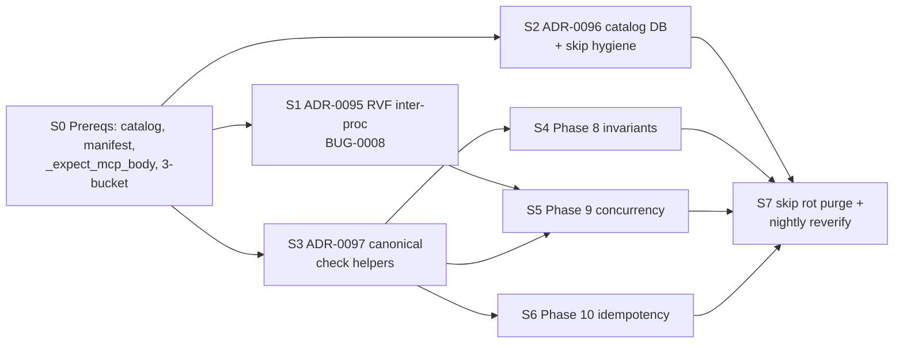

# Parallelism + CI Gates — 8-Sprint Plan

## 1. Sprint DAG

Strict: S0 gates all; S1→S5 (t3-2 stable before 3 more concurrent invariants); S3→S4/S5/S6 (helpers); S2→S7 (DB). Parallel: post-S0 `{S1,S2,S3}` (distinct files — rvf-backend.ts, catalog-rebuild.mjs, lib/*.sh); post-S3 `{S4,S5,S6}`. Critical path = S0 → S3 → {S4|S5|S6} → S7; S1 is only critical if it slips past S5.

## 2. CI Gates (exit conditions)

| Sprint | Exit gate |
|---|---|
| S0 | `catalog --show` valid · manifest 239 · `_expect_mcp_body`+`_mcp_invoke_tool` stubs · 3-bucket runner · preflight clean · cascade ≤150s |
| S1 | t3-2 green 3×/day × 3 days at N=6 · rename-atomicity probe green · `grep "SQLITE_BUSY\|database is locked" lib/` empty · BUG-0008 closed · ADR-0094→Implemented |
| S2 | `catalog.db` ≥1 run · 55 skips classified into 5 buckets · fingerprints ≥20 · output_excerpt scrub unit-green · strict-JSON regression green |
| S3 | Helpers in `lib/acceptance-common.sh` · every phase 1-7 file sources it · inlined `node -e` → 0 · helper unit tests green |
| S4 | 6 invariants green on fresh init'd project · ≤20s · each calls `_expect_mcp_body` · wired into test-acceptance.sh |
| S5 | 4 concurrency checks green · ≤30s · each asserts primary path (lock-file/row-count/header) NOT error strings · stable 3×/day × 3 days |
| S6 | 4 idempotency checks green · ≤10s · `f(x);f(x)` row-count delta verified |
| S7 | Every skip has bucket+probe · nightly passes · `skip_streak_days>30` empty/ticketed · cascade ≤300s confirmed 3× |

Enforcement: closing PR flips ADR Status; preflight fails if ADR says Implemented but catalog disagrees.

## 3. Within-Sprint Parallelism

- **S0 (5):** manifest-gen ‖ catalog-schema ‖ skip-bucket-harness ‖ helper-stubber ‖ budget-profiler.
- **S1 (6, hierarchical):** root-cause FIRST → architect → {implementer ‖ adversarial-reviewer ‖ probe+integration-tester}.
- **S2 (3 tracks):** schema+FKs ‖ skip-reverify classifier+probes ‖ fingerprint derivation. Merge at `catalog-rebuild.mjs`.
- **S3 (4):** helper-implementer ‖ callsite-migrator (sed swarm, 27 files) ‖ unit-tester ‖ ADR-amender.
- **S4 (3×2):** A={memory,session}, B={agent,claims}, C={workflow,config}. 6 parallel at runtime via `run_check_bg`.
- **S5 (4, 1 check each):** rvf-writes (validates S1) ‖ claims-race ‖ session-race ‖ workflow-race.
- **S6 (1, serial build / parallel run):** 4 tiny checks.
- **S7 (2 tracks):** nightly-reverify-runner ‖ rot-purger.

## 4. Budget Allocation (300s cap; 122s current, 178s headroom)

| Item | Spend | Location |
|---|---:|---|
| Phase 8 invariants | +20s | parallel group |
| Phase 9 concurrency | +30s | parallel group |
| Phase 10 idempotency | +10s | parallel group |
| Catalog ingest | +3s | post-run same proc |
| S3 helper dedup | −5s | cascade reduction |
| **Net** | **+58s** | |
| **Projected cascade** | **180s** | 120s headroom |

**Not in cascade:** skip-reverify → nightly (55 × ~2s = 110s, unaffordable); fingerprint dashboard → post-hoc; t3-2 3×/day stability → separate cron.

## 5. Retire-or-Fold Rule (Principle #7)

**Low-value** = foldable iff **ALL three** hold:

1. **Lifecycle-superseded** — newer lifecycle/invariant covers same `(surface_id, depth_class)` AND asserts strictly stronger post-condition (body-level, not exit-only).
2. **Age + stability** — ≥90 days green, zero flakes, ≥30 consecutive daily runs at current assertion.
3. **Surface class** — read-only surfaces qualify once lifecycle sibling lands; mutation surfaces do NOT retire until Phase 9 covers the race.

Fold PR MUST cite catalog row (check_id + streak), the superseding tuple, and delete the retired check in the same commit. Preflight blocks additions that push cascade >300s unless bundled with a fold.

## 6. Regression Cadence

- **Per-sprint:** cascade green on PR (blocking).
- **Per ADR→Implemented:** 3×/day × 3 days green in main before log flips.
- **Nightly:** cascade + skip-reverify + fingerprint-churn; issue on fingerprint-new or rot-flag.
- **Weekly:** `catalog-rebuild.mjs --from-raw` — verifies migrations, FKs, truncate-rebuild.

Paid 30-40×/week — what makes the 300s budget honest.
